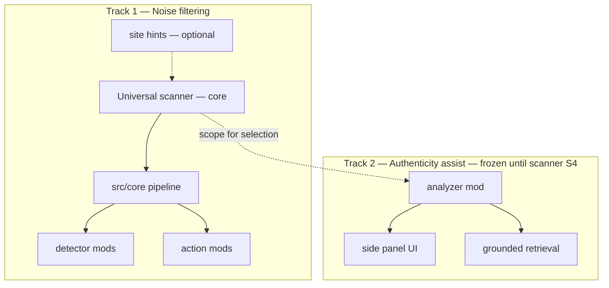

# Documentation

Navigation hub for **SignalLens** — a personal browsing layer for focus-first reading, user-defined filtering, and optional research assist.

## Quick links

| I want to… | Start here |
|------------|------------|
| **Platform plan (purposeful browsing, Preferences, 1-min setup)** | [`planning/purposeful-browsing-roadmap.md`](./planning/purposeful-browsing-roadmap.md) |
| **Version roadmap (v2.0 → v3.0 production)** | [`planning/version-roadmap.md`](./planning/version-roadmap.md) |
| **UX & capability roadmap (personas, text-first scope)** | [`planning/ux-capability-roadmap.md`](./planning/ux-capability-roadmap.md) |
| **Universal scanner** | [`planning/universal-scanner-roadmap.md`](./planning/universal-scanner-roadmap.md) |
| **v3.0 acceptance checklist (launch QA)** | [`planning/v3-acceptance-checklist.md`](./planning/v3-acceptance-checklist.md) |
| **Structured dogfood sign-off (A-R5)** | [`qa/dogfood-signoff.md`](./qa/dogfood-signoff.md) |
| **Scope FAQ & known limitations (A-R4)** | [`scope-faq.md`](./scope-faq.md) |
| **Wizard-first setup checklist** | [`planning/wizard-first-checklist.md`](./planning/wizard-first-checklist.md) |
| **v2.3.0 release ops (Track C)** | [`planning/v2.3-release-ops.md`](./planning/v2.3-release-ops.md) |
| **v2.2.0 store prep (prior RC)** | [`planning/v2.2-store-prep.md`](./planning/v2.2-store-prep.md) |
| Capture store screenshots | [`../store/SCREENSHOTS.md`](../store/SCREENSHOTS.md) |
| See product phases (historical) | [`planning/product-roadmap.md`](./planning/product-roadmap.md) |
| Build or load the Firefox extension | [`guides/firefox-build.md`](./guides/firefox-build.md) |
| Set up local development | [`guides/development.md`](./guides/development.md) |
| Package for Chrome / Firefox stores | [`guides/store-release.md`](./guides/store-release.md) |
| Understand authenticity assist (experimental) | [`experimental/authenticity-analysis.md`](./experimental/authenticity-analysis.md) |
| Install and run locally | [`../README.md`](../README.md) |

## Folder map

```
docs/
├── README.md              ← you are here (navigation)
├── planning/              Product direction, phases, architecture notes
├── guides/                Build, deploy, and platform-specific how-tos
└── experimental/          Exploratory features (not core until proven)
```

## Planning

| Document | Description | Status |
|----------|-------------|--------|
| [`planning/universal-scanner-roadmap.md`](./planning/universal-scanner-roadmap.md) | **Universal scanner** — Phase I / Core Phase 7 (S0–S5) | **Active** |
| [`planning/product-roadmap.md`](./planning/product-roadmap.md) | Product phases A–G (complete); Phase I active | **Active** |
| [`../CORE-ROADMAP.md`](../CORE-ROADMAP.md) | Technical core Phases 1–6 (complete); Phase 7 active | **Active** |
| [`../ROADMAP.md`](../ROADMAP.md) | Repository roadmap entry point | Index |
| [`../v2-roadmap.md`](../v2-roadmap.md) | Legacy v2 design spec | Historical |

→ Category index: [`planning/README.md`](./planning/README.md)

## Guides

| Document | Description |
|----------|-------------|
| [`guides/development.md`](./guides/development.md) | Local setup, build profiles, load extension, test authenticity |
| [`guides/firefox-build.md`](./guides/firefox-build.md) | Firefox MV2 build and load instructions |

→ Category index: [`guides/README.md`](./guides/README.md)

## Experimental

| Document | Description |
|----------|-------------|
| [`experimental/README.md`](./experimental/README.md) | Principles and index of exploratory features |
| [`experimental/authenticity-analysis.md`](./experimental/authenticity-analysis.md) | Selection-first claim verification assist |

## Two product tracks



Legacy site adapters (`src/site-adapters/`) remain in the repo but are **frozen** — replaced by the universal scanner path. See [`planning/universal-scanner-roadmap.md`](./planning/universal-scanner-roadmap.md).

| Track | Question | Default behavior | Doc |
|-------|----------|------------------|-----|
| **Noise filtering** | Is this noise *for me*? | Automatic while browsing (opt-in protection) | [`planning/product-roadmap.md`](./planning/product-roadmap.md) Phases A–F |
| **Authenticity assist** | Is this claim worth verifying? | User selects text → advisory flag | [`experimental/authenticity-analysis.md`](./experimental/authenticity-analysis.md) Phase G |

Track 2 **never** auto-blocks content and **never** shares the filter enforcement pipeline.

## Repository map (code)

```
src/core/scanner/           — universal discovery (Phase 7 — planned)
src/core/                   — pipeline, IPC, registries, runtime host
src/mods/detectors/         — heuristic, local-pack, remote-api, …
src/mods/actions/           — dim, blur, collapse
src/site-adapters/          — legacy; frozen
src/mods/analyzers/         — authenticity assist (frozen until scanner S4)
src/dashboard/              — options page, wizard (frozen until scanner S4)
src/scanner.ts              — seed walker (shadow DOM)
docs/                       — this folder
```

## Build profiles

| Command | Profile | Contents |
|---------|---------|----------|
| `pnpm build` | **core** | Heuristic + generic adapter + dim |
| `pnpm build:full` | **full** | Site adapters, optional ONNX, blur/collapse, remote-api |

See [`../README.md`](../README.md) for install and load instructions.
