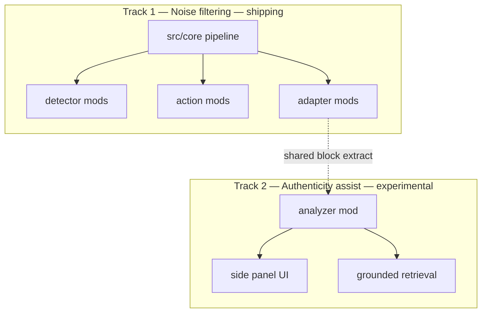

# Documentation

Documentation for the browser extension (working name TBD). The project is a **personal browsing layer**: reduce noise, browse on your terms, optional research assist — not a moralizing “detox” filter.

## Roadmaps

| Document | Scope | Status |
|----------|--------|--------|
| [`product-roadmap.md`](./product-roadmap.md) | Product phases A–G: rename, dashboard, wizard, rules, plugin library, authenticity mod | **Active** |
| [`../CORE-ROADMAP.md`](../CORE-ROADMAP.md) | Technical core refactor (Phases 1–6) | **Complete** |
| [`../ROADMAP.md`](../ROADMAP.md) | Entry point → links here | Index |
| [`../v2-roadmap.md`](../v2-roadmap.md) | Legacy v2 design spec (historical) | Superseded for planning |

## Guides

| Document | Description |
|----------|-------------|
| [`firefox-build.md`](./firefox-build.md) | Firefox MV2 build and load instructions |

## Experimental

| Document | Description |
|----------|-------------|
| [`experimental/README.md`](./experimental/README.md) | Index of exploratory features |
| [`experimental/authenticity-analysis.md`](./experimental/authenticity-analysis.md) | Selection-first claim verification assist (advisory flags, grounded citations) |

## Two product tracks



| Track | Question | Default behavior | Doc |
|-------|----------|------------------|-----|
| **Noise filtering** | Is this noise *for me*? | Automatic while browsing (opt-in protection) | [`product-roadmap.md`](./product-roadmap.md) Phases A–F |
| **Authenticity assist** | Is this claim worth verifying? | User selects text → advisory flag | [`experimental/authenticity-analysis.md`](./experimental/authenticity-analysis.md) Phase G |

Track 2 **never** auto-blocks content and **never** shares the filter enforcement pipeline.

## Repository map (code)

```
src/core/           — pipeline, IPC, registries, runtime host
src/mods/detectors/ — heuristic, local-pack, remote-api, …
src/mods/actions/   — dim, blur, collapse
src/site-adapters/  — Reddit, YouTube, Quora, generic
src/mods/           — mod manifest, load-builtin-mods
docs/               — this folder
```

Future (not implemented): `src/mods/analyzers/` for authenticity and similar assist mods.

## Build profiles

| Command | Profile | Contents |
|---------|---------|----------|
| `pnpm build` | **core** | Heuristic + generic adapter + dim (~367 KB JS) |
| `pnpm build:full` | **full** | Site adapters, optional ONNX, blur/collapse, remote-api |

See [`../README.md`](../README.md) for install and load instructions.
