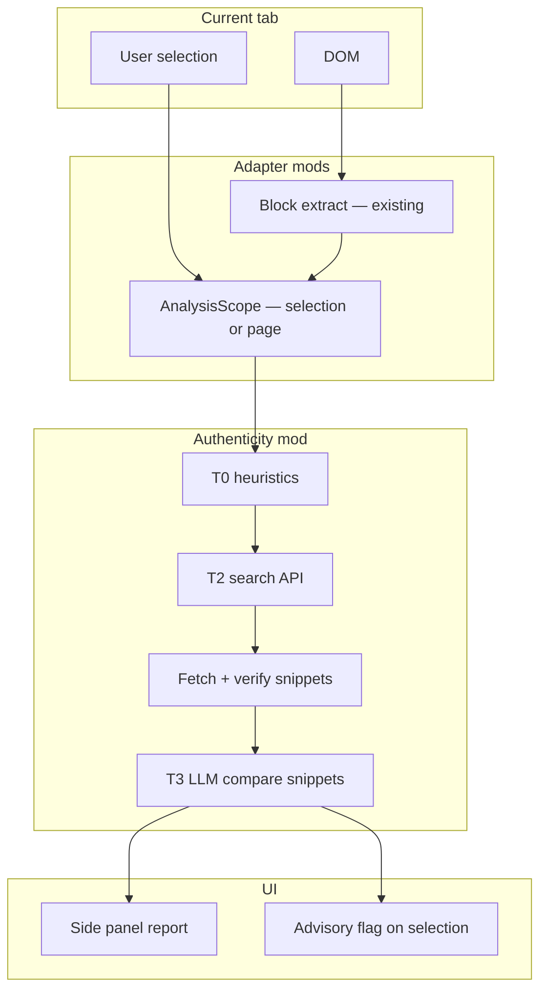

# Experimental: Page authenticity & misinformation assist

> **Status:** Idea / exploration — not scheduled for implementation  
> **Category:** Assistive analysis (distinct from noise filtering)

## One-line pitch

Use AI to help a user **evaluate claims on the page they are viewing** — social posts, forum threads, Q&A answers — by structuring what is said, flagging plausible issues, and pointing to cross-references the user can verify themselves.

**Useful?** Yes, for research-heavy browsing and skeptical reading.  
**Simple to build?** No. This is a different product surface from block-level noise filtering.

---

## How this differs from the core pipeline

| | Noise filtering (core today) | Authenticity assist (experimental) |
|---|------------------------------|-------------------------------------|
| **Unit** | Content block | **User selection** (default); full page opt-in for articles |
| **Question** | “Is this irrelevant/noisy for *me*?” | “Is this claim worth verifying?” |
| **Output** | `Verdict` → dim/blur/collapse | Advisory flag + report + grounded references |
| **Default behavior** | Automatic while browsing (protection on) | **Explicit** — select text, then analyze |
| **Data leaving device** | Optional (remote-api escalation) | Tiered; search/LLM user-approved |
| **Wrong answer cost** | User reveals block | User may over-trust flags — mitigated by auditable trail |

The core should **not** own truth. Authenticity belongs in an **optional mod** with strict opt-in, clear uncertainty, and no silent auto-hiding based on “misinformation” scores.

---

## Why implementation is hard

### 1. Claim extraction is non-trivial

A webpage is not a single document. Adapters already extract blocks; authenticity needs a **higher layer**:

- Main article vs comments vs sidebar vs ads
- Quotes, sarcasm, satire, edited screenshots
- Threads where context lives in parent comments

Requires: structured page model (adapter + `PageContext` type), then claim segmentation (LLM or rules).

### 2. “Cross-reference” needs external ground truth

Rapid cross-check against “multiple sources” implies:

- Search APIs (Google, Bing, Brave, SerpAPI, …)
- News/fact-check databases (limited coverage, licensing)
- Encyclopedic sources (Wikipedia — incomplete for breaking news)
- User-provided allowlist of trusted domains

None of this runs fully offline at useful quality today. A **local ONNX pack** can score tone or toxicity; it **cannot** verify whether a statistic about Afghanistan tariffs is current.

### 3. Latency and cost

Full-page analysis + retrieval + synthesis is **seconds to tens of seconds** and **token-expensive**. Incompatible with the current content-script batch pipeline (designed for millisecond–second block classification).

Needs: separate job queue, progress UI, cancellation, caching per URL.

### 4. Hallucination and liability

Models invent citations, merge unrelated sources, and overstate confidence. UX must:

- Never show “Verified ✓” without human-auditable links
- Prefer “We found N sources that discuss X; they disagree on Y”
- Surface **epistemic status**: unsupported / disputed / consistent with sources / unknown

### 5. Platform and legal constraints

- Scraping ToS, API quotas, geo restrictions
- Defamation / “misinformation” labeling in some jurisdictions
- User data sent to third-party LLMs (privacy policy, enterprise blockers)

### 6. Integration with existing mods

Site adapters (Reddit, Quora, YouTube) know DOM structure; detectors know scoring. Authenticity needs **new interfaces** (sketch below) so core stays unchanged.

---

## Proposed architecture (mod-first)

Keep core filtering as-is. Add an experimental **analysis mod** behind a feature flag.



### New interfaces (conceptual)

```typescript
/** Structured snapshot of what the user is reading — not just text blocks. */
type PageContext = {
  readonly url: string;
  readonly title: string;
  readonly siteId: string;
  readonly mainContent: readonly ContentBlock[];
  readonly thread?: ThreadContext;
  readonly extractedAt: number;
};

type Claim = {
  readonly id: string;
  readonly text: string;
  readonly sourceBlockId: string;
  readonly type: 'factual' | 'opinion' | 'prediction' | 'unknown';
};

type AnalysisScope =
  | { readonly kind: 'selection'; readonly text: string; readonly blockId?: string }
  | { readonly kind: 'thread'; readonly rootBlockId: string; readonly maxReplies: number }
  | { readonly kind: 'full_page'; readonly warnDenseSite: boolean };

type SourceReference = {
  readonly id: string;
  readonly url: string;
  readonly title: string;
  readonly snippet: string;
  readonly fetchedAt: number;
  readonly snippetVerified: boolean;
  readonly stance: 'supports' | 'contradicts' | 'neutral' | 'unknown';
};

type AuthenticityAssessment = {
  readonly claimId: string;
  readonly summary: string;
  readonly confidence: 'low' | 'medium' | 'high';
  readonly epistemicStatus: 'unsupported' | 'disputed' | 'partially_supported' | 'unknown';
  readonly referenceIds: readonly string[];
  readonly limitations: string;
  readonly advisoryOnly: true;
};
```

Registration pattern matches existing mods: `registerPageAnalyzer()`, `registerRetrievalProvider()`, optional `registerAuthenticityUI()`.

---

## Product principles (agreed)

### Selection-first analysis

**Default:** user selects a specific passage, comment, post, or block — then requests analysis.

| Scope | Recommended? | Typical use |
|-------|--------------|-------------|
| **Selection / block** | ✅ Default | Social posts, forum replies, Q&A answers, tweet threads |
| **Thread root + N replies** | ✅ With cap | Reddit/Quora context without analyzing the whole feed |
| **Full page** | ⚠️ Opt-in only | Blogs, articles, academic papers, long-form docs |
| **Full social feed** | ❌ Not offered | Too dense, expensive, low signal |

UI should show a **scope picker** before any API call: “Selected text (recommended)” vs “Full article (may use more quota).” On known dense sites (Reddit, X, Facebook), default to selection and show a gentle warning if the user chooses full page.

### Flag, never block

The system **does not remove or hide** content based on authenticity scores.

- Output is an **advisory flag** on the analyzed selection (badge, underline, or side-panel note).
- Copy uses cautious language: “Sources not found,” “Disputed,” “Worth verifying” — never “False” or “Misinformation confirmed.”
- User always retains full access to the original text; flags are dismissible.
- No integration with dim/blur/collapse enforcement actions for authenticity results.

---

## Preventing erroneous or fabricated citations

**Rule zero:** the LLM must never be the source of URLs. It may only **summarize and compare text that the system already fetched** from verified retrieval steps.

### Grounded citation pipeline


### Rigorous guidelines (enforce in code, not prompts alone)

| # | Rule | Implementation |
|---|------|----------------|
| 1 | **Retrieve-then-read** | Search API returns URLs; extension or backend fetches page text; LLM never invents links. |
| 2 | **Allowlist domains** | Only cite URLs from search results or user-configured trusted domains (`.gov`, `.edu`, Reuters, etc.). |
| 3 | **No URL from model output** | Parse LLM JSON; drop any `url` field not in the retrieval set. Reject response if model adds URLs. |
| 4 | **Snippet grounding** | Every quoted snippet must fuzzy-match text extracted from the fetched page (min overlap threshold). |
| 5 | **Structured output only** | JSON schema: `claimId`, `epistemicStatus`, `referenceIds[]` — no free-form markdown links from the model. |
| 6 | **Epistemic humility** | Allowed statuses: `unknown`, `unsupported`, `disputed`, `partially_supported` — not `proven_false` or `verified_true`. |
| 7 | **Human-auditable trail** | Report shows: claim → query → result URL → fetched excerpt → LLM comparison. User can open each link. |
| 8 | **Empty is honest** | If retrieval returns nothing useful, report says “No corroborating sources found” — never fabricate to fill gaps. |
| 9 | **Fact-check feeds first** | When available (Google Fact Check Tools API, ClaimReview schema), prefer structured fact-check over open web search. |
| 10 | **Two-pass optional** | Cheap local/heuristic pass flags “factual-sounding claim without citation”; expensive retrieval only if user confirms. |

### What we show the user

Instead of “AI says this is wrong,” show:

- **The claim** (quoted from selection)
- **What we searched for** (queries, editable by user)
- **What we found** (0–N sources with clickable URLs and highlighted excerpts)
- **Comparison** (“Source A discusses X but does not mention Y”; “Sources disagree on Z”)
- **Limitations** (“Single source”; “Paywalled”; “Could not fetch”; “Opinion, not fact-checkable”)

### Prompting is insufficient

System prompts (“only cite real sources”) reduce but do not eliminate hallucination. **Architectural constraints** (URL allowlist, schema validation, snippet matching) are required. Treat any LLM-generated URL as a bug.

---

## Minimizing API consumption

Design for **minimum viable intelligence per user action** — tiered pipeline, aggressive caching, and local pre-processing.

### 1. Scope and input limits

- Analyze **selection only** by default (biggest savings on social).
- Hard caps: max characters per request, max claims extracted (e.g. 3–5), max retrieval results (e.g. 5 URLs), max snippet length per source.
- **Thread mode:** root post + user-selected comment only, not entire comment tree.

### 2. Tiered analysis (cheap → expensive)

| Tier | Engine | Cost | When |
|------|--------|------|------|
| **T0** | Local heuristics | Free | Always: “Contains statistic?”, “No links in factual claim?”, word count |
| **T1** | Small local model / ONNX | Low | Optional: claim type classification, “checkworthy?” score |
| **T2** | Search API only | Medium | User confirms “Search for sources” — no LLM yet |
| **T3** | LLM synthesis | High | Only after T2 returns snippets; small context window |

User sees estimated cost before T2/T3 (“~2 search queries, ~1 API call”).

### 3. Caching

- **Report cache** keyed by `hash(selectionText + url + analysisVersion)` in `chrome.storage.session` or IndexedDB.
- **Retrieval cache** keyed by `hash(query)` with TTL (e.g. 24h for news, 7d for stable topics).
- **Dedup** identical selections on same page within session.

### 4. Batching and debouncing

- Do not analyze on hover or scroll.
- Single explicit action: button, context menu, or keyboard shortcut.
- Queue concurrent requests; cancel in-flight if user changes selection.

### 5. Model choice

**Remote cloud**

- Use **small / fast models** for claim extraction and comparison (not flagship reasoning models).
- Separate calls: (a) extract claims JSON, (b) compare claim to pre-fetched snippets — smaller prompts than end-to-end “research this page.”
- User brings own API key; show token/usage estimate in dashboard.

**Local on-device**

- Local models for T0/T1 only (claim detection, checkworthiness) — not full verification.
- Full RAG verification stays remote unless user opts into local LLM with clear quality tradeoff.
- Reuse existing lazy ONNX loading pattern; do not bundle large LLMs in core build.

### 6. Retrieval without LLM (zero-token mode)

Offer **“Search only”** mode: extension runs queries, opens top N results in tabs or lists them — user reads sources themselves. No synthesis call. Useful for privacy and cost.

### 7. Rate limits and quotas

- Per-user daily cap (configurable in dashboard).
- Warn before full-page analysis on dense sites.
- Backoff on API errors; never retry blindly in a loop.

### 8. Context packaging

- Send **claims + snippets**, not full page HTML, to the LLM.
- Strip nav, ads, boilerplate via adapters before tokenization.
- Truncate with explicit “[truncated]” marker rather than silent cut.

---

## Recommended UX (assistive, not punitive)

1. **User selects text or block** → “Analyze selection” (default).
2. **Optional:** “Analyze full article” with scope warning and quota estimate (hidden or discouraged on social site adapters).
3. **Progress panel** — Extracting → Claims → Searching → Report (cancel anytime).
4. **Report view** — Claims with epistemic status, **only pre-validated source links**, limitations block.
5. **Inline flag** — Subtle advisory badge on analyzed selection; dismissible; never blocks content.
6. **Privacy + cost summary** before first use and before each full-page run.

Aligns with product value: **help the user decide**, don’t replace their judgment.

---

## Phased exploration (if we pursue it)

### Spike 0 — Feasibility (1–2 weeks)

- [ ] Manual script: Reddit post URL → extract title + body + top comments → prompt user API → markdown report
- [ ] Measure latency, cost, citation quality
- [ ] Document failure modes (no sources, wrong sources, hallucinated URLs)

**Exit criteria:** Honest assessment of whether quality is good enough for a browser assist.

### Spike 1 — In-extension shell

- [ ] Side panel page (`sidepanel.html` or options tab)
- [ ] **Selection-based** “Analyze” via context menu + content-script highlight
- [ ] Scope picker (selection vs full page with warnings)
- [ ] Hard-coded retrieval stub + user API key; **URL allowlist validation**
- [ ] No integration with filter pipeline

### Spike 2 — Adapter-aware extraction

- [ ] `PageContext` + `AnalysisScope` from Reddit / Quora adapters
- [ ] Claim list UI with jump-to-block; **advisory flags** on selection only
- [ ] Report + retrieval cache by scope hash

### Spike 3 — Grounded citation pipeline

- [ ] Search → fetch → snippet verify → LLM compare (structured JSON)
- [ ] Reject model-emitted URLs; fact-check API integration where available
- [ ] Quota display and tiered T0–T3 pipeline in dashboard

### Not in early spikes

- Automatic always-on page analysis
- Auto-hiding “misleading” comments
- On-device LLM for full claim verification (unless model + RAG quality proven)

---

## Privacy tiers (must pick explicitly)

| Tier | Behavior |
|------|----------|
| **Off** | Feature disabled |
| **Local-only heuristics** | No external retrieval; weak signals (e.g. “no citations in long factual claim”) — limited value |
| **User API** | User supplies endpoint + key; extension sends extracted text; user trusts their provider |
| **Bundled service** | Only if we operate backend — highest compliance burden; unlikely for OSS-first v1 |

Default for any shipping version: **Off** until user completes setup wizard for this mod.

---

## Relationship to remote-api detector

The existing `remote-api` detector mod posts **block batches** for classification scores. Authenticity analysis is a **different contract**:

- Larger payloads (page context, not 800-char blocks)
- Structured JSON report, not `Verdict[]`
- Long-running job, not synchronous batch IPC

Implement as a **separate mod** (`mods/analyzers/authenticity/` or similar), not an extension of `classifyBatch`.

---

## Open research questions

- Side panel vs inline flag — best for “read critically while staying on page”?
- Optimal **max claims per selection** for cost vs usefulness (3 vs 5)?
- “Search only” mode as default before any LLM synthesis?
- Local T1 checkworthiness model — which small model fits extension size budget?
- Fact-check API coverage vs open web search quality by locale

---

## Summary

| Verdict | Notes |
|---------|--------|
| **Product fit** | Strong as an **optional research assistant** aligned with “browse purposefully” |
| **Core fit** | Poor if merged into filter pipeline — keep separate mod + UI |
| **Complexity** | High: extraction, retrieval, synthesis, UX, privacy, hallucination |
| **Suggested next step** | Spike 0 outside the extension; then Side panel shell (Spike 1) if quality is acceptable |

See also: [`../product-roadmap.md`](../product-roadmap.md) for shipping order (dashboard + wizard before heavy experimental mods).
