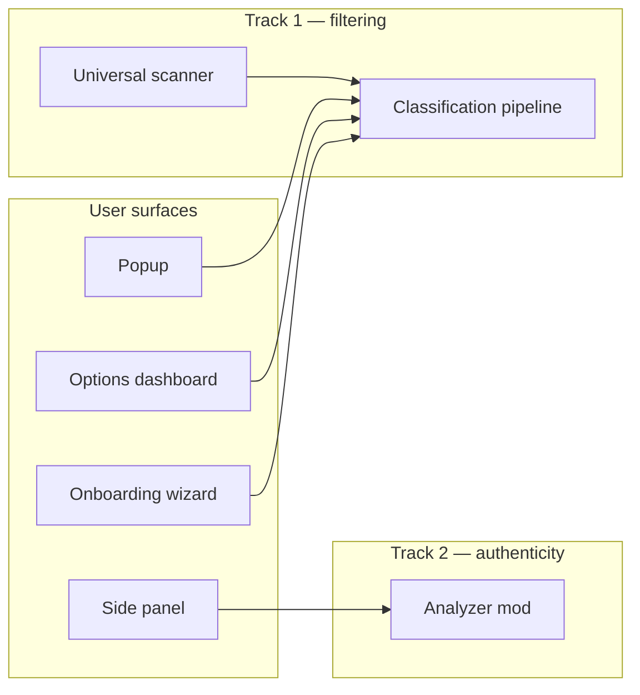

# Product Roadmap

> **Forward-looking plan:** [`version-roadmap.md`](./version-roadmap.md) (v2.0 → **v3.0 initial public release**; refine scanning, filtering, and authenticity pre-launch).  
> **Status:** Phases A–G complete · **Phase I** complete · **Phases 8–11** complete  
> **Scanner spec:** [`universal-scanner-roadmap.md`](./universal-scanner-roadmap.md)  
> **Audience:** Contributors and future users  
> **Doc index:** [`docs/README.md`](../README.md)  
> **Technical core:** [`CORE-ROADMAP.md`](../../CORE-ROADMAP.md) (Phases 1–6 complete; Phase 7 active)

## Product value

**Your time and energy are precious. Browse the web with focus and on your terms.**

This is not a “detox” or moralizing filter. The extension is a **personal browsing layer**:

- **Track 1 — Noise filtering:** reduce irrelevant content using *your* rules and preferences.
- **Track 2 — Authenticity assist (experimental):** help you read critically with *advisory* flags and sourced comparisons — never auto-blocking “untrue” content.

The core provides orchestration (extract → classify → enforce). **Mods and user settings define relevance.** Authenticity analysis is a **separate mod and UI**, not an extension of the filter pipeline.

---

## Conceptual model

Users mix four layers:

| Layer | Question | Examples |
|-------|----------|----------|
| **Intent** | What am I doing right now? | Focus, research, unwind |
| **Signal rules** | What do I care about / ignore? | Keywords, topics, sources, formats |
| **Site behavior** | How should this site behave? | Hide Reddit sidebar; skip YouTube Shorts |
| **Presentation** | How should matches look? | Dim, collapse, hide, annotate |

### Architecture mapping (Track 1)

```
Intent + rules     →  detector mods (heuristic, local-pack, remote-api, future)
Site structure     →  universal scanner (core) + optional site hints (mods)
Visual treatment   →  action mods (dim, blur, collapse, future annotate)
```

> **Pivot (2026):** Site adapters are no longer the primary discovery path. See **Phase I** and [`universal-scanner-roadmap.md`](./universal-scanner-roadmap.md).

### Browsing concepts to explore

1. **Modes / presets** — One tap swaps threshold, keywords, filter style, and enabled site mods.
2. **Allowlists & blocklists** — Per-site or global keyword / domain rules.
3. **Content-type filters** — Promos, outrage bait, engagement bait (detector mods).
4. **Layout mods** — Hide sidebars, promos, “Games on Reddit” (structural noise).
5. **Time budgets** — Soft limits per site or session (future mod).
6. **Reveal-first UX** — Filtered content is always reversible.

---

## Extension surfaces

| Surface | Role | Phase |
|---------|------|-------|
| **Popup** (`index.html`) | On/off, active mode, quick stats | Exists |
| **Options / dashboard** (`options.html`) | Modes, plugin library, per-site rules, quotas, privacy | B |
| **Onboarding wizard** | First-run preset + enabled mods | C |
| **Side panel** (`sidepanel.html`) | Authenticity reports, analysis progress | G ✅ |



*(Side panel / authenticity frozen until Phase I S4 — see below.)*

---

## Product phases

### Technical foundation ✅

Core modular refactor **Phases 1–6** — complete. See [`CORE-ROADMAP.md`](../../CORE-ROADMAP.md).

- Slim default build: heuristic + generic adapter + dim
- Full build opt-in: site adapters, ONNX lazy-load, blur/collapse
- Windows-friendly `pnpm build`

---

### Phase A — Rename & reframe ✅

- [x] New working name: **SignalLens** (temporary)
- [x] Manifest + popup copy: remove “Detox” / “toxicity” framing
- [x] README aligned with “browse on your terms” positioning

**Done when:** Installed extension reads as a browsing utility, not a detox tool. ✅

---

### Phase B — Options dashboard ✅

- [x] `options.html` full-page UI (React, shared components with popup)
- [x] Tabbed options dashboard (Overview, Filtering, Rules, Plugins, Privacy)
- [x] Link to experimental mod settings via Plugins tab (`AuthenticitySettingsPanel`)

**Done when:** All non-essential configuration lives on the options page. ✅

---

### Phase C — Onboarding wizard ✅

- [x] First-run flow (`onboardingComplete` in storage)
- [x] Steps: welcome → what bothers you → filter style → sites you use → sensitivity → done
- [x] Writes `policy`, `inferenceRouting`, `enforcementAction`, `userKeywords`, `preferredSites`, `enabledModIds`
- [x] “Set up again” from dashboard
- [x] Install hook opens `options.html?wizard=1` for new users

**Done when:** New users get a guided preset instead of implicit defaults (hardcoded keywords). ✅

---

### Phase D — User-defined rules ✅

- [x] Custom keyword / topic lists (dashboard editor + topic presets)
- [x] Allow keywords (never filter matching content)
- [x] Allowed domains (pause filtering on selected sites)
- [x] Per-site sensitivity overrides wired into pipeline threshold
- [x] Wizard output feeds into block keyword lists

**Done when:** Filtering reflects user intent; Reddit/forum pages show visible effect for typical setups. ✅

**Priority:** High — unlocks day-to-day value before authenticity work.

---

### Phase E — Plugin library v1 ✅

- [x] UI over `src/mods/mod-manifest.ts` (catalog + enable/disable)
- [x] Extended mod metadata: description, size label, permissions summary
- [x] Runtime enable/disable for bundled mods (dynamic import when toggled on)

**Done when:** Users enable Reddit adapter or blur action without rebuilding. ✅

---

### Phase F — Signed mod installs ✅

- [x] Downloadable mod packages (`signallens-mod/1` JSON + optional asset files)
- [x] Ed25519 signature verification before install (`packages/signing/`, `scripts/sign-mod-package.mjs`)
- [x] Heavy mod asset downloads with hash check + progress UI; lazy gate in `loadBuiltinMods`

**Done when:** Optional mods install from the library without a full rebuild. ✅

---

### Phase G — Authenticity assist mod (experimental → product) ✅

Spec: [`../experimental/authenticity-analysis.md`](../experimental/authenticity-analysis.md)

**Principles (non-negotiable):**

| Principle | Implementation |
|-----------|----------------|
| Selection-first | Default: analyze highlighted text or block; not full social feeds |
| Full-page opt-in | Blogs / papers only; quota warning on dense sites |
| Flag, never block | Advisory badge + side panel; no dim/blur for “misinformation” |
| Grounded citations | Retrieve-then-read; LLM never emits URLs; snippet verification |
| Tiered cost | T0 heuristics → T1 local → T2 search-only → T3 LLM on snippets |
| Explicit action | Context menu / button; no analyze-on-scroll |

**Deliverables:**

- [x] **G1 — Spike 0:** `scripts/authenticity-spike.mjs` (Wikipedia search latency probe)
- [x] **G2 — Selection UI:** Context menu “Analyze selection”; side panel (`sidepanel.html`)
- [x] **G3 — T2 search-only:** Wikipedia / Brave / custom search; auditable links in report
- [x] **G4 — Grounded T3:** Fetch → snippet verify → OpenAI-compatible JSON compare; URL allowlist
- [x] **G5 — Adapter integration:** Site-aware scope + advisory flag on selection (block id when available)
- [x] **G6 — Dashboard:** Quota caps, API keys, tier toggles, search-only default (`AuthenticitySettingsPanel`)

**Done when:** User can select a forum comment, receive an advisory report with auditable sources, and no content is hidden automatically. ✅

**Depends on:** Phase B (settings surface) recommended; Phase D optional but improves adapter maturity.

---

## Experimental features (reference)

| Feature | Doc | Track |
|---------|-----|-------|
| Authenticity / claim assist | [`../experimental/authenticity-analysis.md`](../experimental/authenticity-analysis.md) | 2 |

Future experimental specs → [`../experimental/README.md`](../experimental/README.md).

---

## Current focus — Distribution / store prep ✅

Release tooling and store submission drafts are in place.

| Deliverable | Location |
|-------------|----------|
| Release zip scripts | `pnpm release:chrome`, `pnpm release:firefox` |
| Pre-upload verification | `scripts/verify-store-build.mjs` |
| GitHub Release workflow | `.github/workflows/release.yml` (tag `v*`) |
| Listing + privacy drafts | [`store/`](../../store/) |
| Full guide | [`docs/guides/store-release.md`](../guides/store-release.md) |

**Before first public listing:** rotate mod signing trust anchor, host privacy policy URL, capture screenshots (see checklist).

**Firefox:** run [`docs/guides/firefox-qa.md`](../guides/firefox-qa.md) (`pnpm test:firefox` + manual matrix).

**Next:** Tag `v2.0.x` and upload to stores.

<details>
<summary>Authenticity v2 — complete</summary>

T1 ranking, full-page scope, side panel scope picker shipped.

</details>

<details>
<summary>Phase 10 (Browsing modes) — complete</summary>

```
Phase 10 (browsing modes) — COMPLETE
     │
     ├── 10.1  Mode definitions + apply patch (core)     ✅
     ├── 10.2  Popup mode switcher                       ✅
     ├── 10.3  Dashboard modes panel                     ✅
     └── 10.4  Content script rescan on mode change      ✅
```

</details>

<details>
<summary>Phase 9 (Operational hardening) — complete</summary>

```
Phase 9 (operational hardening) — COMPLETE
     │
     ├── 9.1  GitHub Actions CI (unit + E2E + perf)     ✅
     ├── 9.2  Reddit fixture with anchor attrs          ✅
     ├── 9.3  Anchor fingerprint stability              ✅
     └── 9.4  Dead code cleanup                         ✅
```

</details>

<details>
<summary>Phase 8 (Core consolidation) — complete</summary>

**Phase I (Universal Scanner)** shipped S0–S5: fixtures, pure scanner, diff/coordinator, pipeline integration, acceptance tests, site hints, expand triggers, and recorded Reddit snapshot in CI.

```
Phase 8 (core consolidation) — COMPLETE
     │
     ├── 8.1  Scanner sign-off + CI snapshots        ✅
     ├── 8.2  ContentUnit end-to-end + core enforcement  ✅
     ├── 8.3  Remove adapter discovery path           ✅
     ├── 8.4  Test & perf harness                  ✅
     └── 8.5  Naming & IPC cleanup                  ✅
```

</details>

### Phase I — Universal content discovery ✅

| Sub-phase | Deliverable | Status |
|-----------|-------------|--------|
| **I / S0** | HTML fixtures + scanner test scaffold | ✅ |
| **I / S1** | `UniversalScanner` pure module | ✅ |
| **I / S2** | Stable diff (no runaway rescans) | ✅ |
| **I / S3** | Replace adapter init in content script | ✅ |
| **I / S4** | Acceptance on fixtures + real URLs | ✅ (CI); manual sign-off optional |
| **I / S5** | Optional site hints mods | ✅ |

**Done when:** E2E filtering passes via universal scanner; Reddit thread within ±15% of loaded units with no runaway. ✅ (CI)

---

## Previous focus — Phase I (Universal Scanner) — complete

**Phases A–G** shipped product surfaces. **Phase I** replaced adapter-first discovery with the universal scanner.

<details>
<summary>Phase I sub-phases (archived checklist)</summary>

```
I (S0→S5) Universal scanner — COMPLETE
     │
     ├── S0  Fixtures + invariants
     ├── S1  Pure scanner + unit tests
     ├── S2  Diff + coordinator
     ├── S3  Pipeline integration
     ├── S4  Acceptance (Reddit, scroll, SPA)
     └── S5  Optional site hints
```

</details>

---

## Completed phases (A–G)

All product phases through **G** are shipped. See checklists below for deliverables.

```
A ──► B ──► C ──► D ──► E ──► F ──► G   ✅ Surfaces + experimental assist
                              │
                              └──► I (Universal Scanner)   ⬜ ACTIVE
```

---

## Phase H — Core pipeline hardening (partial)

Track 1 runtime hardening — **classification path** only. Discovery superseded by Phase I.

- [x] **H1 — Inline heuristic runtime (Chrome)**
- [x] **H2 — Session storage fallback**
- [x] **H3 — End-to-end filtering tests**
- [x] **H4 — Allow-keyword enforcement**
- [x] **H5 — Stats accuracy (unique counts)**

**Remaining H work** (after Phase I S3): perf regression tests, runtime diagnostics — not adapter discovery fixes.

---

## Post-v0.1 backlog

| Priority | Theme | Examples | Status |
|----------|-------|----------|--------|
| **8** | **Core consolidation** | Single discovery path, retire adapters | **Complete** |
| **9** | **Operational hardening** | CI, anchor fingerprints, fixtures | **Complete** |
| **10** | **Browsing modes** | One-tap Focus / Research / Unwind presets | **Complete** |
| **11** | **Content-type detectors** | Noise patterns mod (promo / bait) | **Complete** |
| Hardening | Stability, tests, perf | Perf regression, pipeline unit tests | Partial (9.1) |
| UX polish | Dashboard + wizard | Mobile layout, copy | After 8.3 |
| Authenticity v2 | T1 ranking, full-page scope, scope picker | **Complete** |
| Authenticity v3 | Fact-check feeds, thread scope UX | Later |
| Distribution | Release readiness | Store listing, signing keys | **Prep complete** — see `docs/guides/store-release.md` |
| Platform | Firefox parity QA | Side panel on MV2 | **Automated QA** — see `docs/guides/firefox-qa.md` |

---

## Open questions (exploration)

- **Naming** — Brand that reflects personalization, not judgment (working name: SignalLens).
- **Default preset** — Wizard recommendations for “casual” vs “research” browsing.
- ~~**Side panel vs inline-only flags**~~ — Side panel chosen; shipped in Phase G.
- ~~**“Search only” as default**~~ — Implemented via `searchOnlyDefault` setting.
- **Mod marketplace** — Bundled-only vs signed third-party; curation model (F provides install path).
- **Firefox parity** — Options, wizard, authenticity UI on MV2 (built; needs QA pass).

---

## Core v0.2 checklist (discovery — Phase I) ✅

| # | Criterion | Status |
|---|-----------|--------|
| 1 | Universal scanner passes fixture unit tests | ✅ |
| 2 | Pipeline fed by scanner (not primary adapters) | ✅ |
| 3 | E2E filtering passes on fixture server | ✅ |
| 4 | Reddit acceptance: ±15%, no runaway | ✅ (CI snapshot) |
| 5 | Heuristic provider, no model files (unchanged) | ✅ |

**Product v0.2** — Phase **I** delivered. **v0.3** requires Phase 8 (core consolidation).

---

## Notes

- Legacy `detox` prefixes may remain in code during migration.
- **Active technical work:** [`universal-scanner-roadmap.md`](./universal-scanner-roadmap.md) · [`CORE-ROADMAP.md`](../../CORE-ROADMAP.md) Phase 7
- [`v2-roadmap.md`](../../v2-roadmap.md) is historical; use this file for forward planning.
