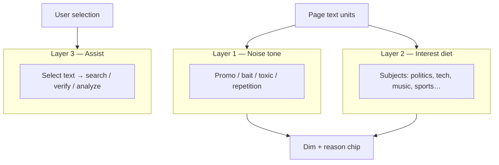

# Purposeful browsing roadmap

> **Purpose:** Product positioning + delivery plan for SignalLens as a **personal browsing assistant** — not only a noise filter.  
> **Companions:** [`version-roadmap.md`](./version-roadmap.md) · [`v3-focused-launch-scope.md`](./v3-focused-launch-scope.md) · [`ux-capability-roadmap.md`](./ux-capability-roadmap.md) · [`research-semantic-topics.md`](./research-semantic-topics.md) · [`wizard-first-checklist.md`](./wizard-first-checklist.md)

---

## Product identity

**SignalLens helps people browse with intent:** keep what matters, quiet what doesn’t, and act on what they’re reading — with setup that fits diverse tastes in about a minute.

| Job | User question | Product surface |
|-----|---------------|-----------------|
| **Steer** | “More of what I care about, less of what I don’t.” | Modes, noise rules, interest / topic diet, packs |
| **Act** | “Help me do something with this text.” | Selection search, authenticity assist, compare |
| **Understand** | “What’s going on on this page?” | Page / selection analysis (opt-in) |

**Store wedge (v3.0 Option A):** excellent **text noise** steering (promo, bait, toxic language), reveal-first, honest text-only scope.  
**Platform identity (ongoing):** the three jobs above — noise filtering is chapter one, not the whole story.

### Non-goals (keep explicit)

- Not a misinformation / “truth” enforcer on feeds  
- Not an image / video moderator through v3.x  
- Not permanent deletion of content  
- Not a dashboard-first power-user tool as the default path

---

## Preference model (three layers)

Users confuse “less politics” with “less spam.” The product must keep these **separate in UX and badges**.



| Layer | Example goal | Mechanism today | Productization target |
|-------|--------------|-----------------|------------------------|
| **1 Noise** | Less engagement bait & toxic comments | Keywords, behavior signals, adaptation packs | v3.0 launch hero |
| **2 Interest** | Less world affairs; keep tech & music | Keyword “geopolitics” preset (weak on phrase-poor headlines); semantic topic diet (full build, experimental) | v3.1 — first-class, wizard + Preferences |
| **3 Assist** | Check / search a selected claim | Authenticity side panel (experimental) | v3.2 — selection tools bundle |

**Example persona (maintainer):** enjoy music + tech, reduce political content → Layer 2 allow `tech`/`music`, block `world-affairs` / `domestic-politics`, with Layer 1 still catching bait in any topic.

---

## UX north stars

### 1. One-minute setup (hard goal)

A new user with **no prior SignalLens knowledge** should reach “filtering matches my intent” in **≤ 60 seconds** on the happy path.

| Path | Target time | Steps |
|------|-------------|-------|
| **Express** | ≤ 45s | Welcome → pick **one lifestyle preset** → Done (Focus + sensible noise + optional interest seeds) |
| **Guided** | ≤ 90s | Welcome → mode → **interests** (like / less of) → whitelist optional → Done |
| **Custom** | 2–3 min | Today’s full custom wizard (power users) |

**Exit criteria (manual + later automated):**

- [ ] Express path: ≤ 4 decisions, no empty-state traps, Focus on by default  
- [ ] Guided path asks **interests in plain language** (“More of…” / “Less of…”), not detector jargon  
- [ ] ≥ 80% of dogfooders never open the dashboard on day one  
- [ ] Dashboard remains **easy to find** for later personalization

### 2. Preferences home (dashboard)

The dashboard is the **ongoing personalization hub**, not the required first step.

| Area | Job | Priority |
|------|-----|----------|
| **Overview** | Mode, on/off, “what happened today,” jump to Preferences | P0 |
| **Preferences** (new IA name or Rules redesign) | Interests, noise presets, whitelist, sensitivity, filter style | P0 |
| **Insights** | Why blocked, feedback patterns, wrong-block fixes | P1 |
| **Assist** | Selection tools, authenticity (experimental) | P1 |
| **Advanced** | Packs, mods, remote API, debug | P2 |

**Preferences must support diverse users without writing keyword lists:**

- Lifestyle / interest chips (tech, music, sports, politics, business, culture…)  
- Noise intensity (Focus / Unwind / Research)  
- Site pause / whitelist presets (work, university, music players)  
- One-click “restore recommended for my preset”

### 3. Instant feedback loop

After setup, the user should **see** that personalization worked: sample page, first-browse badge, or “3 items filtered — here’s why.”

---

## Diverse-user presets (catalog v0)

Ship **named starting points** so people don’t invent a policy from scratch. Each preset writes Layer 1 + (when ready) Layer 2 seeds.

| Preset ID | Pitch | Noise (L1) | Interest seeds (L2) | Mode |
|-----------|-------|------------|---------------------|------|
| `focus-calm` | Less bait & outrage | Outrage, bait, spam | — | Focus |
| `less-politics` | Follow news without drowning in geopolitics | Balanced noise | Block world-affairs + domestic-politics | Focus |
| `tech-music` | Keep tech & music; quiet politics | Light noise | Allow tech + music; block world-affairs | Focus |
| `comment-shield` | Survive toxic threads | Toxic + hostile packs | — | Unwind |
| `deep-read` | Long articles / papers | Conservative | — | Research |
| `blank-canvas` | I will tune everything | Minimal | Off | Focus |

Presets are **starting points**, not locked profiles — one tap opens Preferences to adjust chips.

---

## Delivery roadmap

### Phase P0 — Ship the wedge · **v2.3 → v3.0** (locked Option A)

**Theme:** Trustworthy text noise filter + honest scope + store ops. Do not block launch on interest diet or assist hero.

| Track | Work | Type |
|-------|------|------|
| **Ops** | Track C: unlisted v2.3.0 → dogfood → listed v3.0.0 | Release |
| **Logic** | FP tuning (non-social), block reasons, reveal feedback | Functional |
| **UX** | Wizard &lt; 2 min; Overview + Rules usable; scope FAQ | User-facing |
| **Docs** | Positioning: personal browsing layer; store = noise wedge | Messaging |

**Done when:** [`v3-acceptance-checklist.md`](./v3-acceptance-checklist.md) §A–§D + §F + §G pass.

---

### Phase P1 — Preferences for everyone · **v3.0.x / v3.1.0**

**Theme:** Diverse users personalize in plain language; dashboard becomes Preferences home; setup drops toward **one minute**.

#### User-facing

| # | Deliverable | Notes |
|---|-------------|-------|
| P1-U1 | **Express wizard path** | Lifestyle / intent preset → Done; ≤ 45s |
| P1-U2 | **“More of / Less of” interest step** | Chips mapped to L2 when available; until then map geopolitics + keyword seeds honestly labeled |
| P1-U3 | **Preferences hub** | Consolidate topic presets, topic diet, whitelist, sensitivity under one mental model |
| P1-U4 | **Preset gallery** | `focus-calm`, `less-politics`, `tech-music`, `comment-shield`, `deep-read` |
| P1-U5 | **Post-setup confirmation** | Express done review + dashboard banner; topic seeds callout |

#### Functional logic

| # | Deliverable | Notes |
|---|-------------|-------|
| P1-L1 | **Semantic topic diet exit criteria** | Per [`research-semantic-topics.md`](./research-semantic-topics.md); BBC/Reddit dogfood |
| P1-L2 | **Separate reason chips** | Noise vs topic never merged |
| P1-L3 | **Policy coherence** | Mode + packs + topic policy don’t fight; Research stays conservative |
| P1-L4 | **Core vs full honesty** | If L2 needs full build, Express path either bundles minimal centroids or offers clear upgrade |

**Exit:** New user picks `tech-music` (or equivalent) in ≤ 60s; politics headlines dim on phrase-poor news **when L2 enabled**; tech/music mostly pass; dashboard Preferences editable without keyword editing.

---

### Phase P2 — Assist as convenience · **v3.2.x**

**Theme:** Selection tools make browsing *useful*, not only quieter.

**Detailed spec (draft, scope open):** [`assist-capability-spec.md`](./assist-capability-spec.md) — intents (search / define / verify / compare / personal index), principles, phases A0–A4.

| # | Deliverable | Job |
|---|-------------|-----|
| P2-U1 | Context menu: **Search selection** (engine configurable) | Act |
| P2-U2 | Context menu / side panel: **Verify / authenticity** (hardened script-first) | Act |
| P2-U3 | **Compare** selected snippet to page or cached sources (lightweight) | Act |
| P2-U4 | Optional **page outline / key claims** (opt-in, not auto-filter) | Understand |
| P2-L1 | Assist quota, cache, auditable trail | Logic |
| P2-L2 | Wizard: optional “enable assist tools” (off by default) | UX |

**Exit:** Assist is discoverable from selection; never auto-hides feed content; store may mention as optional secondary feature.

---

### Phase P3 — Depth & ecosystem · **v3.3+**

| Theme | Examples |
|-------|----------|
| Layout mods | Collapse comment regions (structural) |
| Pack marketplace | Community adaptation packs, more locales |
| Interest taxonomy v1 | More topics; per-site interest overrides |
| Insights v2 | Suggested toggles from wrong-block feedback |
| Visual assist | Track 3 only — see [`../experimental/visual-analysis.md`](../experimental/visual-analysis.md) |

---

## Dashboard information architecture (target)

```
Overview          → status, mode, recent activity, “Edit preferences”
Preferences       → Interests | Noise | Sites | Style & sensitivity
Insights          → filtered history, reasons, feedback
Assist            → selection tools, authenticity (experimental)
Advanced          → packs, plugins, models, privacy/debug
```

**Migration note:** Today’s **Rules / Filtering / Plugins** tabs map into Preferences + Advanced without removing power features — rename and regroup first; avoid a second parallel settings tree.

---

## Functional logic backlog (cross-cutting)

Improvements that support every phase; prioritize by launch risk.

| Area | Improvement | Phase |
|------|-------------|-------|
| Scanner | SPA stability, site hints, perf gates | P0 |
| Noise scoring | FP audits, non-social thresholds, behavior tuning | P0 |
| Enforcement | Affordance, appearance, reveal reliability | P0 |
| Topic classifier | Latency, centroids, corpus quality, local-first | P1 |
| Policy merge | Unified filter + topic policy + packs | P1 |
| Assist pipeline | Script gather → verify → LLM compare | P2 |
| Feedback → policy | Suggest preset/chip changes from “wrong block” | P3 |

---

## Success metrics

| Metric | P0 (v3.0) | P1 | P2 |
|--------|-----------|----|----|
| Time to first useful config | ≤ 2 min | ≤ 60s Express | ≤ 60s + assist discoverable |
| Wizard-only setup rate | ≥ 80% | ≥ 85% | ≥ 85% |
| Wrong-block rate (dogfood) | Acceptable on §D | Topic layer doesn’t spike noise FPs | Assist unused ≠ broken |
| Preference edit without keywords | Partial (presets) | Majority via chips | + assist toggles |
| Store complaint theme | “Doesn’t do images” OK; “confusing setup” not OK | “Can’t do interests” not OK | — |

---

## Relationship to existing docs

| Doc | Role after this roadmap |
|-----|-------------------------|
| [`v3-focused-launch-scope.md`](./v3-focused-launch-scope.md) | **Unchanged** — P0 launch lock |
| [`version-roadmap.md`](./version-roadmap.md) | Release versions; P1+ detail lives here |
| [`ux-capability-roadmap.md`](./ux-capability-roadmap.md) | Personas A–E; this doc adds **intent presets** + Preferences IA |
| [`assist-capability-spec.md`](./assist-capability-spec.md) | **Draft** Act-layer spec: verify / define / compare / source packs |
| [`research-semantic-topics.md`](./research-semantic-topics.md) | Engineering spike for Layer 2 |
| [`wizard-first-checklist.md`](./wizard-first-checklist.md) | Extend with Express path when implemented |

---

## Immediate next steps (recommended order)

1. ~~**Finish P0 / Track C automated gates**~~ — `pnpm release:preflight` green (C-R3). Remaining: store upload (C-R1), Firefox manual QA (C-R2), screenshots, dogfood.
2. ~~**Define Express presets**~~ — `src/onboarding/express-presets.ts` + `setupPath: 'express'` apply path (keyword + topic seeds).
3. ~~**Wire Express path in wizard UI**~~ — welcome preset gallery → done in 2 steps; guided customize unchanged.
4. ~~**Preferences IA sketch** against current `OptionsApp` tabs.~~ — Rules tab renamed to Preferences; grouped Interests | Noise | Sites | Style & sensitivity.
5. **Gate semantic topic diet** — Spike 3 manual BBC/Reddit dogfood; then enable Layer 2 from Express seeds.
6. **Assist convenience (P2)** — **deferred**; see [`assist-capability-spec.md`](./assist-capability-spec.md). Reopen after P1 topic-diet gate + §7 decisions.

---

## Open decisions

| Question | Options | Lean |
|----------|---------|------|
| Can Express interest diet ship on **core** build? | Keyword seeds only vs require full/ONNX | Keyword seeds for v3.0.x; semantic L2 in full → promote when quality passes |
| Rename Rules → Preferences now or at v3.1? | Soft regroup vs hard rename | Soft regroup in P1-U3 |
| How many Express presets at first? | 3 vs 6 | Start with **4**: calm, less-politics, tech-music, deep-read |
| Selection search: in-extension UI vs hand off to browser/tab? | Side panel vs `https://…?q=` | Hand-off first (fast); panel later |
