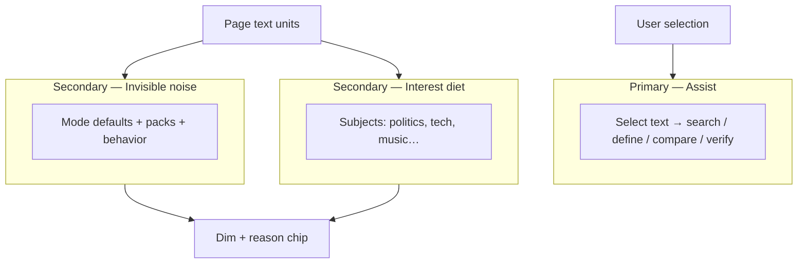

# Purposeful browsing roadmap

> **Purpose:** Product positioning + delivery plan for SignalLens as a **personal browsing assistant** — not only a noise filter.  
> **Companions:** [`version-roadmap.md`](./version-roadmap.md) · [`v3-focused-launch-scope.md`](./v3-focused-launch-scope.md) · [`ux-capability-roadmap.md`](./ux-capability-roadmap.md) · [`research-semantic-topics.md`](./research-semantic-topics.md) · [`wizard-first-checklist.md`](./wizard-first-checklist.md)

---

## Product identity

**SignalLens helps people browse and research efficiently:** select text to search, define, compare, and analyze — while an invisible engine quietly dims bait and toxic language in the background.

| Job | User question | Product surface | Priority |
|-----|---------------|-----------------|----------|
| **Act** | “Help me do something with this text.” | Selection Assist (search / define / compare / verify) | **Primary** |
| **Understand** | “What’s going on on this page?” | Page / selection analysis (opt-in) | Primary-adjacent |
| **Steer** | “Quiet noise; keep what I care about.” | Modes, sensitivity, topic diet, site pause — **no keyword editors** | **Secondary** |

**Near-term ship (Assist-first pivot):** selection retrieval tools as the hero; noise via [`invisible-noise-engine.md`](./invisible-noise-engine.md).  
**Superseded:** v3.0 Option A store lock (“text noise filter” as sole hero) — see [`v3-focused-launch-scope.md`](./v3-focused-launch-scope.md).

### Non-goals (keep explicit)

- Not a misinformation / “truth” enforcer on feeds  
- Not an image / video moderator through v3.x  
- Not permanent deletion of content  
- Not a dashboard-first power-user tool as the default path

---

## Preference model (three layers)

Users confuse “less politics” with “less spam.” Keep these **separate in UX and badges**. Assist is the primary job; noise is invisible steer.



| Layer | Example goal | Mechanism | Productization |
|-------|--------------|-----------|----------------|
| **Assist** | Research / retrieve / compare | Selection toolbar + menus | **Core product surface** (A1 shipped) |
| **Invisible noise** | Less bait & toxic comments | Fixed engine — no keyword UI ([spec](./invisible-noise-engine.md)) | Secondary, always-on defaults |
| **Interest** | Less world affairs; keep tech & music | Semantic topic diet (full build) | Preferences Interests |

**Example persona:** research a claim while browsing → Assist search/compare; topic diet (full) quiets politics; invisible noise still dims bait in any topic.

---

## UX north stars

### 1. One-minute setup (hard goal)

A new user with **no prior SignalLens knowledge** should reach “filtering matches my intent” in **≤ 60 seconds** on the happy path.

| Path | Target time | Steps |
|------|-------------|-------|
| **Express** | ≤ 45s | Welcome → pick **one lifestyle preset** → Done (Focus + sensible noise + optional interest seeds) |
| **Guided** | ≤ 90s | Welcome → mode → **interests** (like / less of) → whitelist optional → Done |
| **Custom** | 2–3 min | Today’s full custom wizard (power users) |

**Exit criteria (manual + later automated):**

- [ ] Express path: ≤ 4 decisions, no empty-state traps, Focus on by default  
- [ ] Guided path asks **interests in plain language** (“More of…” / “Less of…”), not detector jargon  
- [ ] ≥ 80% of dogfooders never open the dashboard on day one  
- [ ] Dashboard remains **easy to find** for later personalization

### 2. Preferences home (dashboard)

The dashboard is the **ongoing personalization hub**, not the required first step.

| Area | Job | Priority |
|------|-----|----------|
| **Overview** | Assist tip, mode, on/off, activity | P0 |
| **Assist** | Selection tools, search engine, authenticity (advanced) | P0 |
| **Preferences** | Interests, automatic quieting, whitelist, sensitivity, filter style | P0 |
| **Insights** | Why blocked, feedback patterns | P1 |
| **Advanced** | Packs, mods, remote API, debug | P2 |

**Preferences without keyword lists:**

- Interest chips / topic diet (full build)  
- Noise intensity via mode + sensitivity only (invisible engine)  
- Site pause / whitelist presets  
- No block/allow keyword editors anywhere in the dashboard

### 3. Instant feedback loop

After setup, the user should **see** that personalization worked: sample page, first-browse badge, or “3 items filtered — here’s why.”

---

## Diverse-user presets (catalog v0)

Ship **named starting points** so people don’t invent a policy from scratch. Each preset writes Layer 1 + (when ready) Layer 2 seeds.

| Preset ID | Pitch | Noise (L1) | Interest seeds (L2) | Mode |
|-----------|-------|------------|---------------------|------|
| `focus-calm` | Less bait & outrage | Outrage, bait, spam | — | Focus |
| `less-politics` | Follow news without drowning in geopolitics | Balanced noise | Block world-affairs + domestic-politics | Focus |
| `tech-music` | Keep tech & music; quiet politics | Light noise | Allow tech + music; block world-affairs | Focus |
| `comment-shield` | Survive toxic threads | Toxic + hostile packs | — | Unwind |
| `deep-read` | Long articles / papers | Conservative | — | Research |
| `blank-canvas` | I will tune everything | Minimal | Off | Focus |

Presets are **starting points**, not locked profiles — one tap opens Preferences to adjust chips.

---

## Delivery roadmap

### Phase P0 — Assist-first pivot · **current**

**Theme:** Selection Assist as hero; invisible noise engine; remove keyword editors. Option A noise-only store lock is **superseded**.

| Track | Work | Type |
|-------|------|------|
| **Act** | A1 toolbar/menus (search / define / compare / verify bridge) | Functional |
| **Steer** | Invisible noise contract; no dashboard/wizard keyword UI | Functional |
| **UX** | Assist tab; Preferences without Noise keyword lists | User-facing |
| **Docs** | Assist-first identity; store listing rewrite follow-up | Messaging |
| **Ops** | Track C release path continues; copy must match Assist-first before public list | Release |

---

### Phase P1 — Preferences for everyone · **v3.0.x / v3.1.0**

**Theme:** Diverse users personalize in plain language; dashboard becomes Preferences home; setup drops toward **one minute**.

#### User-facing

| # | Deliverable | Notes |
|---|-------------|-------|
| P1-U1 | **Express wizard path** | Lifestyle / intent preset → Done; ≤ 45s |
| P1-U2 | **“More of / Less of” interest step** | Chips mapped to L2 when available; until then map geopolitics + keyword seeds honestly labeled |
| P1-U3 | **Preferences hub** | Consolidate topic presets, topic diet, whitelist, sensitivity under one mental model |
| P1-U4 | **Preset gallery** | `focus-calm`, `less-politics`, `tech-music`, `comment-shield`, `deep-read` |
| P1-U5 | **Post-setup confirmation** | Express done review + dashboard banner; topic seeds callout |

#### Functional logic

| # | Deliverable | Notes |
|---|-------------|-------|
| P1-L1 | **Semantic topic diet exit criteria** | Per [`research-semantic-topics.md`](./research-semantic-topics.md); BBC/Reddit dogfood |
| P1-L2 | **Separate reason chips** | Noise vs topic never merged — topic primary badge keeps noise in `secondaryReasons` |
| P1-L3 | **Policy coherence** | Mode + packs + topic policy don’t fight; Research pauses topic diet and restores on Focus/Unwind |
| P1-L4 | **Core vs full honesty** | If L2 needs full build, Express path either bundles minimal centroids or offers clear upgrade |

**Exit:** New user picks `tech-music` (or equivalent) in ≤ 60s; politics headlines dim on phrase-poor news **when L2 enabled**; tech/music mostly pass; dashboard Preferences editable without keyword editing.

---

### Phase P2 — Assist depth · **post-A1**

**Theme:** Deepen Assist beyond A1 handoff (still never auto-filters the feed).

**Spec:** [`assist-capability-spec.md`](./assist-capability-spec.md) — A2–A4 (academic packs, personal index, hardened verify).

| # | Deliverable | Job |
|---|-------------|-----|
| P2-U1 | ~~Search / Define / Compare toolbar~~ | **Done (A1)** |
| P2-U2 | Hardened **Verify** (script-first authenticity) | Act |
| P2-U3 | Richer compare / source packs | Act |
| P2-U4 | Optional **page outline / key claims** | Understand |
| P2-L1 | Assist quota, cache, auditable trail | Logic |

**Exit:** Assist remains primary store story; A2–A4 optional depth.

---

### Phase P3 — Depth & ecosystem · **v3.3+**

| Theme | Examples |
|-------|----------|
| Layout mods | Collapse comment regions (structural) |
| Pack marketplace | Community adaptation packs, more locales |
| Interest taxonomy v1 | More topics; per-site interest overrides |
| Insights v2 | Suggested toggles from wrong-block feedback |
| Visual assist | Track 3 only — see [`../experimental/visual-analysis.md`](../experimental/visual-analysis.md) |

---

## Dashboard information architecture (target)

```
Overview          → Assist tip, status, mode, recent activity
Assist            → selection tools, search engine, authenticity (advanced)
Preferences       → Interests | Automatic quieting | Sites | Style & sensitivity
Filtering         → stats / preview (secondary)
Plugins           → packs, models, detectors
Privacy           → data, theme, debug
```

**Invariant:** no keyword list editors under Preferences or wizard.

---

## Functional logic backlog (cross-cutting)

Improvements that support every phase; prioritize by launch risk.

| Area | Improvement | Phase |
|------|-------------|-------|
| Scanner | SPA stability, site hints, perf gates | P0 |
| Noise scoring | FP audits, non-social thresholds, behavior tuning | P0 |
| Enforcement | Affordance, appearance, reveal reliability | P0 |
| Topic classifier | Latency, centroids, corpus quality, local-first | P1 |
| Policy merge | Unified filter + topic policy + packs | P1 |
| Assist pipeline | Script gather → verify → LLM compare | P2 |
| Feedback → policy | Suggest preset/chip changes from “wrong block” | P3 |

---

## Success metrics

| Metric | P0 (v3.0) | P1 | P2 |
|--------|-----------|----|----|
| Time to first useful config | ≤ 2 min | ≤ 60s Express | ≤ 60s + assist discoverable |
| Wizard-only setup rate | ≥ 80% | ≥ 85% | ≥ 85% |
| Wrong-block rate (dogfood) | Acceptable on §D | Topic layer doesn’t spike noise FPs | Assist unused ≠ broken |
| Preference edit without keywords | Partial (presets) | Majority via chips | + assist toggles |
| Store complaint theme | “Doesn’t do images” OK; “confusing setup” not OK | “Can’t do interests” not OK | — |

---

## Relationship to existing docs

| Doc | Role after this roadmap |
|-----|-------------------------|
| [`v3-focused-launch-scope.md`](./v3-focused-launch-scope.md) | **Unchanged** — P0 launch lock |
| [`version-roadmap.md`](./version-roadmap.md) | Release versions; P1+ detail lives here |
| [`ux-capability-roadmap.md`](./ux-capability-roadmap.md) | Personas A–E; this doc adds **intent presets** + Preferences IA |
| [`assist-capability-spec.md`](./assist-capability-spec.md) | **Draft** Act-layer spec: verify / define / compare / source packs |
| [`research-semantic-topics.md`](./research-semantic-topics.md) | Engineering spike for Layer 2 |
| [`wizard-first-checklist.md`](./wizard-first-checklist.md) | Extend with Express path when implemented |

---

## Immediate next steps (recommended order)

1. ~~**Finish P0 / Track C automated gates**~~ — `pnpm release:preflight` green (C-R3). Remaining: store upload (C-R1), Firefox manual QA (C-R2), screenshots, dogfood.
2. ~~**Define Express presets**~~ — `src/onboarding/express-presets.ts` + `setupPath: 'express'` apply path (keyword + topic seeds).
3. ~~**Wire Express path in wizard UI**~~ — welcome preset gallery → done in 2 steps; guided customize unchanged.
4. ~~**Preferences IA sketch** against current `OptionsApp` tabs.~~ — Rules tab renamed to Preferences; grouped Interests | Noise | Sites | Style & sensitivity.
5. **Gate semantic topic diet** — Automated BBC+Reddit corpus gates green (`pnpm spike3`); remaining: manual live dogfood, then enable Layer 2 from Express seeds.
6. **Assist convenience (P2)** — **deferred**; see [`assist-capability-spec.md`](./assist-capability-spec.md). Reopen after P1 topic-diet gate + §7 decisions.

---

## Open decisions

| Question | Options | Lean |
|----------|---------|------|
| Can Express interest diet ship on **core** build? | Keyword seeds only vs require full/ONNX | Keyword seeds for v3.0.x; semantic L2 in full → promote when quality passes |
| Rename Rules → Preferences now or at v3.1? | Soft regroup vs hard rename | Soft regroup in P1-U3 |
| How many Express presets at first? | 3 vs 6 | Start with **4**: calm, less-politics, tech-music, deep-read |
| Selection search: in-extension UI vs hand off to browser/tab? | Side panel vs `https://…?q=` | Hand-off first (fast); panel later |
