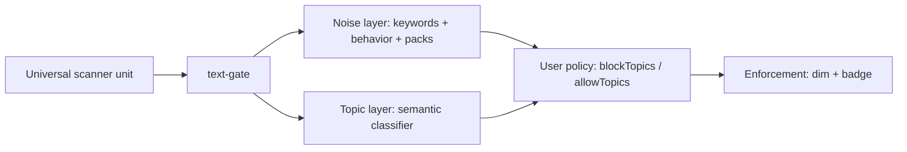

# Research: semantic topic filtering (Track D)

> **Status:** Active research (post–v3.0 dogfood)  
> **Decision:** Prioritize **semantic topics** over keyword expansion and structural layout mods (B) for “interest / news diet” goals.  
> **v3.0 launch:** Unchanged — noise-only, reveal-first. Topic layer is **v3.1+** until spikes pass exit criteria below.

---

## Problem statement

Dogfood on **BBC** showed **0 filtered** with geopolitics keywords enabled. Headlines are often **topic-rich but phrase-poor** (“Armenia votes…”, “Cecilia Bartoli: A voice defies time”). Keyword lists match **wording**, not **subject**.

**Social feeds (Reddit)** remain a better fit for **noise** detectors (engagement hooks, outrage phrasing). Topic classification addresses a **different user goal**:

| Goal | Layer | v3.0 |
|------|-------|------|
| Less promo / bait / outrage **tone** | Noise (keywords, behavior, packs) | ✅ Ship |
| Less politics / news **subject** | Topic (semantic) | 🔬 Research |

Personal preference example: **allow tech + music**, **reduce world-affairs** — that is a **topic diet**, not a spam filter.

---

## Design principles

1. **Two layers, never merged in UX** — “Engagement hook” and “Politics” must be separate chips; users can block topics without blocking bait.
2. **Reveal-first** — topic blocks dim like noise; click to show.
3. **Opt-in** — topic filtering off by default; not part of v3.0 store hero.
4. **Local-first** — prefer on-device inference (full build / ONNX or small transformers); no upload of feed text.
5. **Honest scope** — topics apply to **text units** the scanner already extracts; image-only units still invisible.

---

## Taxonomy v0 (proposal)

Start with **8 topics** — enough for BBC/Reddit dogfood, small enough to label reliably:

| Topic ID | Includes | Excludes (boundary notes) |
|----------|----------|---------------------------|
| `world-affairs` | Elections, wars, diplomacy, geopolitics | Domestic culture pieces |
| `domestic-politics` | National policy, parliament, elections (country-specific) | World news |
| `tech` | Software, hardware, dev tools, AI product news | Pure science papers |
| `music` | Artists, albums, concerts, streaming | Generic “entertainment” |
| `culture-arts` | Film, books, opera, reviews (e.g. Bartoli headline) | Celebrity gossip bait |
| `business` | Markets, companies, earnings | Crypto pump spam → noise layer |
| `health-science` | Medicine, research news, public health | Personal medical advice threads |
| `sports` | Matches, leagues, scores | — |

**User rule shape (future):**

```ts
blockTopics: ['world-affairs', 'domestic-politics']
allowTopics: ['tech', 'music']  // optional: pass even if other signals weak
```

**Not in v0:** religion, crime, entertainment-gossip (too noisy); split later if eval demands.

---

## Architecture fit (current codebase)

Today `classifyUnifiedFilter()` merges **heuristic**, **noise patterns**, and **behavior signals** — all **tone/noise** (`unified-filter.ts`).

**Proposed addition — parallel topic pass:**



- Topic classifier returns `{ topicId, confidence }[]` (multi-label or top-k).
- **Block** if `max(confidence) ≥ threshold` for any `blockTopics` entry.
- **Allow** overrides block when topic ∈ `allowTopics` (user’s tech/music case).
- Badge shows **topic label**, not “noise” — e.g. `World affairs · 74%`.

**Integration points (when implementing):**

- `classification-pipeline.ts` — optional topic step after gate
- `format-block-reason.ts` — topic label keys
- `Rules` / wizard — topic toggles (not 19 phrase chips)
- `filter-audit-engine.ts` — topic corpus + FP/FN gates (mirror Focus audit)

---

## Approach ladder

| Stage | Method | Effort | Cross-language |
|-------|--------|--------|----------------|
| **D0** | Keywords (done) | Low | Poor — BBC failed |
| **D1** | Embedding similarity to topic prompts | Medium spike | Moderate |
| **D2** | Zero-shot NLI (`entailment` per topic) via transformers.js | Medium | Good |
| **D3** | Fine-tuned small multi-label head on DistilBERT-class | High | Good with locale data |

**Research order:** D1 offline notebook → D2 extension spike (full build) → D3 only if D2 FP too high on tech/medical corpus.

**Existing assets:** `@xenova/transformers` in full build; offscreen/on-device pattern already used for ONNX. Core build stays heuristic-only; topic mod is **full-build or signed pack**.

---

## Evaluation (extend filter-audit pattern)

Create `tests/fixtures/filtering/topic-corpus.json`:

```json
{
  "version": 1,
  "samples": [
    {
      "id": "bbc-armenia-votes",
      "text": "Armenia votes as Russia piles pressure on pro-West government",
      "expect": { "primaryTopic": "world-affairs", "block": true }
    },
    {
      "id": "bbc-bartoli",
      "text": "Cecilia Bartoli: A voice defies time",
      "expect": { "primaryTopic": "culture-arts", "block": false }
    },
    {
      "id": "reddit-antigravity-it",
      "text": "Antigravity CLI funziona meglio rispetto a Code Assist...",
      "expect": { "primaryTopic": "tech", "block": false }
    }
  ]
}
```

**Gates (proposed):**

| Metric | Target |
|--------|--------|
| BBC political headline recall | ≥ 80% labeled `world-affairs` or `domestic-politics` |
| Culture/music headline FP | ≤ 5% blocked when user allows those topics |
| Tech comment FP (Italian EN mix) | ≤ 5% wrong topic |
| Medical/clinical prose FP | ≤ 5% blocked as politics/spam topic |

Script: `pnpm test:topic-audit` (future) — same spirit as `test:filter-audit`.

---

## Research spikes (no v3.0 ship)

### Spike 1 — Corpus labeling (1–2 days)

- [x] Seed corpus **37 units** in `tests/fixtures/filtering/topic-corpus.json`
- [x] Labeling guide: [`topic-corpus-labeling-guide.md`](./topic-corpus-labeling-guide.md)
- [x] D0 baseline audit: `pnpm test:topic-audit` → `artifacts/topic-audit-report.txt`
- [ ] Expand to **200 units**: 80 BBC, 60 Reddit, 40 tech, 20 music/review
- [ ] Inter-rater: re-label 20% after 48h; aim κ ≥ 0.7

### Spike 2 — D1 embedding baseline (offline)

- [x] Sentence embeddings (`Xenova/all-MiniLM-L6-v2`) + max-pool cosine to topic prompts
- [x] `src/core/filtering/topic-embedding-classifier.ts` + per-topic metrics in audit report
- [x] `pnpm test:topic-embedding-audit` → `artifacts/topic-embedding-audit-report.txt`
- [x] **Exit:** Beat geopolitics keyword BBC block rate by ≥ 50pp (research gate on seed corpus)

**Seed corpus results (37 samples):**

| Method | Topic accuracy | World-affairs recall | BBC news-diet recall | Tech false-block |
|--------|----------------|----------------------|----------------------|------------------|
| D0 keywords | 56.8% | 62.5% | 16.7% | 0% |
| D1 embeddings | 78.4% | 100% | **100%** | 0% |

Notes: first model fetch uses `hf-mirror.com` when Hugging Face is unreachable. Optional snapshot: `pnpm precompute:topic-centroids`.

### Spike 3 — D1 topic classifier in extension (full build)

- [x] `detector-topic-classifier` mod (off by default, full build only)
- [x] `topic-classifier` provider in offscreen inference (D1 MiniLM + bundled prompt snapshot)
- [x] Topic diet panel in Rules + separate badge labels (`World affairs · 42%`)
- [x] Merge prefers topic label over noise when both match
- [x] `pnpm test:topic-classifier` — policy unit tests + latency/FP gate on corpus
- [x] **Exit (automated):** BBC seed corpus 100% political recall — `pnpm spike3:bbc` ([`spike3-bbc-results.md`](../qa/spike3-bbc-results.md))
- [ ] **Exit (manual):** Dogfood on BBC + Reddit with mod enabled in full build

### Spike 4 — UX + positioning

- [x] Wizard callout: noise presets ≠ topic diet (`wizard.topics.noiseVsTopicNote`)
- [x] Plugins mod: `detector-topic-classifier` (off by default, full build)
- [x] Scope FAQ: topics ≠ truth, ≠ noise
- [x] Dogfood runbook: [`../qa/topic-dogfood-runbook.md`](../qa/topic-dogfood-runbook.md)
- [ ] Manual dogfood sign-off on BBC + Reddit (Spike 3 exit)

---

## Risks and mitigations

| Risk | Mitigation |
|------|------------|
| Tech/medical text classified as politics | Holdout corpus; allowTopics override; don’t merge with behavior layer |
| Italian/CJK units wrong language | Per-unit language detect before topic (research parallel track) |
| Model size / review | Full build only; optional download pack |
| “AI categorizes your feed” backlash | Opt-in, local, reveal-first; not v3.0 hero |
| Conflating topic with misinformation | Never auto-block for “false”; topic only |

---

## Explicitly deferred

- **B (layout mods)** — still valid for BBC rails; deprioritized while D is explored
- **Geopolitics keyword expansion** — frozen; keywords remain for tone presets only
- **v3.0 launch scope** — no topic classifier in listed build until Spike 3 exits

---

## Open decisions

1. **Multi-label vs single primary topic** — multi-label fits mixed headlines; UI shows primary only?
2. **Default block set** — empty vs “world-affairs” when user enables topic mod?
3. **Core vs full build** — topic mod only in full build acceptable?
4. **Minimum text length** — reuse `shouldClassifyText()` or lower for short headlines?

---

## Related

- [`v3-focused-launch-scope.md`](./v3-focused-launch-scope.md) — v3.0 noise-only launch
- [`ux-capability-roadmap.md`](./ux-capability-roadmap.md) — persona boundaries
- [`../experimental/visual-analysis.md`](../experimental/visual-analysis.md) — not topic replacement
- Noise audit: `tests/core/false-positive-audit.spec.ts`
