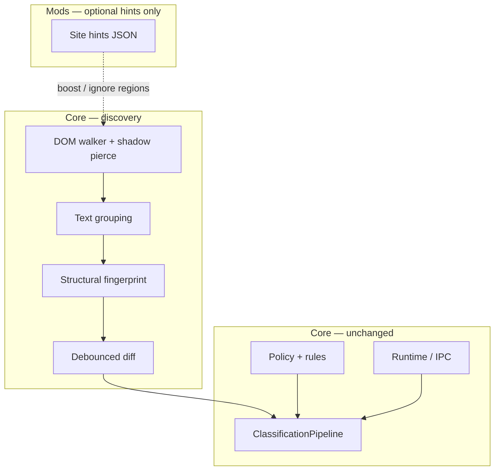

# Universal Scanner Roadmap

> **Status:** Complete (S0–S5) · **Follow-on:** [`CORE-ROADMAP.md`](../../CORE-ROADMAP.md) Phase 8  
> **Audience:** Contributors  
> **Parent:** [`product-roadmap.md`](./product-roadmap.md) Phase I · [`CORE-ROADMAP.md`](../../CORE-ROADMAP.md) Phase 7  
> **Doc index:** [`../README.md`](../README.md)

## Why this exists

Site-specific adapters (Reddit, YouTube, generic heuristics) cannot reliably discover content across the open web. They chase unstable DOM ids, fight virtualized feeds, and produce either **runaway rescans** or **zero scans**. Classification, policy, and UI are usable; **target acquisition is not**.

This roadmap replaced adapter-first discovery with a **universal scanner** in core. **S0–S5 are complete.** Phase 8 consolidates to a single discovery path.

## Product value (unchanged)

**Your time and energy are precious.** SignalLens helps you browse with focus. That only works if the extension consistently finds the text you are actually reading.

## Scanner contract

The universal scanner answers one question:

> **What text units on this page are worth classifying?**

**Input:** live `Document` (including shadow roots)  
**Output:** deduplicated `ContentUnit[]` — `{ id, text, element }` — fed into the existing `ClassificationPipeline`

It does **not** need to understand site-specific semantics (post vs comment). It needs **good-enough completeness**, **no duplicates**, and **stable identity across DOM churn**.

## North-star invariants

| # | Invariant | Meaning |
|---|-----------|---------|
| **I1** | Good-enough completeness | On fixture pages, ≥90% of visible prose blocks appear in the scan set |
| **I2** | Scan once per visit | Each fingerprint classified **at most once** per page session |
| **I3** | Monotonic discovery | Scrolling adds units; count plateaus — never explodes on a single thread |

If a change violates any invariant, it does not ship.

## Architecture (target)

### Core owns (new)

| Module | Role |
|--------|------|
| `src/core/scanner/universal-scanner.ts` | Walk DOM, group text, emit units |
| `src/core/scanner/fingerprints.ts` | Stable id from structure + text |
| `src/core/scanner/filters.ts` | Exclude chrome (nav, buttons, hidden) |
| `src/core/scanner/scan-diff.ts` | `{ added, updated }` vs previous snapshot |
| `src/core/scanner/scan-coordinator.ts` | Single observer + idle diff → pipeline |

### Core keeps (existing)

- `ClassificationPipeline`, progressive pump, verdict cache
- Policy, rules, enforcement actions
- IPC, runtime host, detector mods

### Mods demoted (not deleted yet)

| Was | Becomes |
|-----|---------|
| `SiteAdapter` as **primary** discovery | Legacy path; **frozen** |
| Reddit / YouTube / Quora adapters | Optional **site hints** after acceptance |
| Generic adapter heuristics | Replaced by universal scanner |

Seed code: [`src/scanner.ts`](../../src/scanner.ts) (shadow-piercing walker — extend, do not discard).

---

## Phases

### S0 — Spec & fixtures ✅

**Goal:** Define “done” before more production code.

- [x] Document invariants I1–I3 (this file)
- [x] Add HTML fixtures under `tests/fixtures/scanner/`:
  - [x] `blog-article.html` — paragraphs + nav sidebar
  - [x] `nested-comments.html` — one unit per comment, not per text node
  - [x] `dom-swap.html` — same text, replaced node → same fingerprint
  - [x] `shadow-dom.html` — text inside shadow root
  - [x] `chrome-heavy.html` — buttons, aside, footer excluded
- [x] Add `tests/scanner/universal-scanner.spec.ts` (unit tests against fixtures; no extension)

**Done when:** Fixtures exist; tests scaffold runs (may fail until S1). ✅

Run: `pnpm test:scanner:s0` (passes) · `pnpm test:scanner` (S1 tests fail until implementation)

---

### S1 — Pure scanner ✅

**Goal:** Universal scanner as a **pure function** — no content script, no adapters.

- [x] Implement `UniversalScanner.scan(root) → ContentUnit[]`
- [x] Group adjacent text nodes into units (min word/char thresholds)
- [x] Fingerprint ids: structural path + text hash prefix (no DOM `id` dependency)
- [x] Shadow DOM piercing (extend `scanner.ts` approach)
- [x] Chrome exclusion rules (roles, landmarks, tag blacklist)
- [x] Unit tests: all S0 fixtures green

**Done when:** `pnpm test` scanner suite passes offline; zero extension changes.

---

### S2 — Diff & coordinator ✅

**Goal:** Stable rescans without runaway counts.

- [x] `scanDiff(prev, next) → { added, updated }` — **no hard remove** on virtualization
- [x] Debounced coordinator (single `MutationObserver` + idle callback)
- [x] Visibility priority via existing `IntersectionObserver` pattern
- [x] Expand / load-more click triggers + attribute observation
- [x] Fixture test: DOM swap → `added.length === 0`, fingerprint unchanged

**Done when:** Diff tests green; I2 holds on `dom-swap` fixture.

---

### S3 — Pipeline integration ✅

**Goal:** Replace adapter init path with universal scanner.

- [x] Wire `ScanCoordinator` → `ClassificationPipeline.handleBlocksAdded`
- [x] Feature flag: `useUniversalScanner` (default **on** in dev)
- [x] Freeze site adapter registration in content script when flag on
- [x] Existing E2E [`tests/core-filtering.spec.ts`](../../tests/core-filtering.spec.ts) still passes
- [x] Per-page stats use unique fingerprint set (I2)

**Done when:** Extension classifies on fixture server via universal scanner only.

---

### S4 — Acceptance (real pages) ✅

**Goal:** Validate on hard cases — manual + recorded snapshots.

| Scenario | Success criterion | CI |
|----------|-------------------|-----|
| Static article | ≥90% prose blocks found; 0 duplicate classifies | `acceptance/static-article.html` + vitest |
| Reddit thread (~250–1k comments) | Scanned within **±15%** of loaded post + comments; no runaway | Synthetic 48-comment snapshot in vitest |
| Infinite scroll | Count increases with new viewport content; plateau after idle | `acceptance/infinite-scroll.html` + vitest |
| SPA navigation | Page stats reset; no bleed from previous route | `spa-route-a/b.html` + Playwright |
| Shadow DOM page | Text in shadow roots discovered | `scanner/shadow-dom.html` + vitest |

- [x] Record DOM snapshots for CI where feasible (avoid flaky live network in CI)
- [x] Manual checklist doc in [`tests/README.md`](../../tests/README.md)

**Done when:** All five scenarios pass on agreed URLs. ✅ (CI); manual sign-off in `tests/README.md`.

Run: `pnpm test:scanner:s4` · `pnpm test:e2e:acceptance`

---

### S5 — Site hints (optional) ✅

**Goal:** Precision tuning — **not** required for correctness.

- [x] Hint schema: `{ ignoreSelectors?, boostSelectors? }` — [`site-hints.ts`](../../src/core/scanner/site-hints.ts)
- [x] Bundled hint packs: Reddit, YouTube (gated by `adapter-reddit` / `adapter-youtube` mods)
- [x] Scanner works with zero hints enabled

**Done when:** Hints improve Reddit precision without changing I1–I3. ✅

Run: `pnpm test:scanner:s5`

---

## Explicitly deferred until Phase 8 completes

| Area | Reason |
|------|--------|
| Authenticity v2 / full-page mode | Depends on reliable scope extraction |
| New site adapters | Wrong abstraction |
| Dashboard / wizard polish | No value without discovery |
| Plugin library expansion | Distraction |
| Phase H adapter tuning | Superseded by this track |

---

## Success metrics (v0.2 core)

| Metric | Target |
|--------|--------|
| Fixture completeness (I1) | ≥90% on all S0 fixtures |
| Reddit 500-comment thread | Scanned count stable ±15%; no >2× comment count |
| Rescan rate | 0 duplicate classifies per fingerprint per page visit |
| Time to first scan | <3s on fixture server; <8s on Reddit after hydration |

---

## Migration notes

1. **Do not delete** `src/site-adapters/` until S3 is stable — keep behind flag.
2. **Do not** add rescan timers, adapter-specific ID fallbacks, or stats guards as substitutes for fingerprints.
3. **Do** treat [`src/scanner.ts`](../../src/scanner.ts) as the lineage of the new module.
4. When S4 passes, update [`product-roadmap.md`](./product-roadmap.md) to unblock post-v0.1 UX work.

---

## Related documents

| Document | Role |
|----------|------|
| [`CORE-ROADMAP.md`](../../CORE-ROADMAP.md) | Technical phases 1–6 (complete); Phase 7 = this track |
| [`product-roadmap.md`](./product-roadmap.md) | Product Phase I (active) |
| [`../experimental/authenticity-analysis.md`](../experimental/authenticity-analysis.md) | Frozen until S4 |
