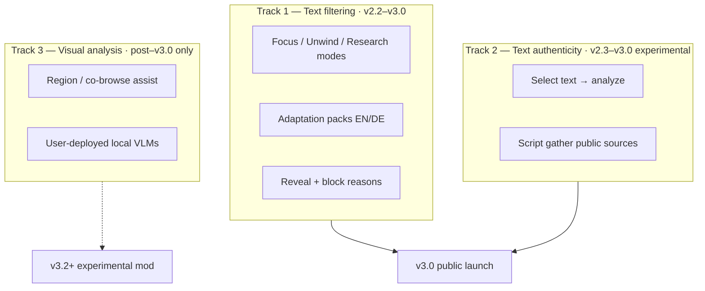

# UX & capability roadmap

> **Purpose:** Persona-driven experience priorities and **capability boundaries** for SignalLens through **v3.0.0** public launch.  
> **Companion:** [`version-roadmap.md`](./version-roadmap.md) (release phases) · [`wizard-first-checklist.md`](./wizard-first-checklist.md) · [`../experimental/visual-analysis.md`](../experimental/visual-analysis.md) (post–v3.0 concept only)

---

## North star

SignalLens is a **personal text layer** for browsing:

1. **Reduce textual noise** while scrolling (protection, preference, reveal-first).
2. **Assist research** on **user-selected written claims** (optional, experimental, public sources only).

It is **not** a media moderation platform, truth enforcement tool, or silent censor.

---

## Capability model

What the extension can analyze **today** and through **v3.0.0**:

| Input | In scope (v3.0) | Notes |
|-------|-----------------|-------|
| Visible page **text** in content units | ✅ Core | Universal scanner; ≥ ~40 chars / 8 words per unit |
| Keywords, noise patterns, behavior signals | ✅ Core | Heuristic + adaptation packs |
| `aria-label`, sponsored DOM hints | ✅ Partial | DOM context signals; not primary scan path |
| Image / video **pixels** | ❌ | Not in v2.x–v3.0 roadmap |
| Image-only posts (no text) | ❌ | Invisible to scanner — **documented limitation** |
| Meme caption (short text) | ⚠️ Partial | Only if caption meets substantive threshold |
| Text **inside** images (screenshots) | ❌ | No OCR in v3.0 |
| User-selected text for authenticity | ✅ Experimental | Opt-in; script gather → AI compare |

### Design principle: honest scope

Users must understand early:

> **SignalLens filters and assists with text. It does not analyze pictures or video.**

This belongs in the wizard, FAQ, store listing, and known-limitations doc — not as an apology, but as a **product boundary**.

---

## Three product tracks

| Track | Question | Default | v3.0 bar |
|-------|----------|---------|----------|
| **1 — Text filtering** | “Is this textual noise *for me*?” | **On** (Focus) | Must feel excellent |
| **2 — Text authenticity** | “What public evidence relates to this *written* claim?” | **Off** | Must be honest & auditable |
| **3 — Visual analysis** | “What is in this image / region?” | N/A | **Out of scope** until post–v3.0 |

Track 3 is **not impossible** long-term (co-browsing with the user, region capture, local vision models) but entails **higher cost**, **advanced setup**, and **different trust model**. See [`../experimental/visual-analysis.md`](../experimental/visual-analysis.md). **Do not schedule Track 3 work in v2.3.x or v3.0.0 sprints.**

---

## Personas & prioritized scenarios

Priority: **P0** = launch-critical · **P1** = strong expectation · **P2** = post-launch · **OOS** = explicitly not promised

### Persona A — Focus seeker (launch priority **#1**)

*Less noise while scrolling social feeds and news.*

| ID | Scenario | Priority | v3.0 deliverable |
|----|----------|----------|------------------|
| A1 | Wizard → Focus on → first site shows dim on bait/promo **text** | P0 | Wizard + Focus defaults |
| A2 | Click filtered block → reveal | P0 | Reveal-first enforcement |
| A3 | See **why** blocked (detector / reason chip) | P0 | Block reason UX |
| A4 | Image-only post unchanged | P0 | Limitation copy in wizard |
| A5 | Switch to Unwind from popup | P1 | Mode switch without dashboard |
| A6 | Meme with caption filtered when text matches | P1 | Packs + behavior signals |

### Persona B — Comment-section survivor (launch priority **#2**)

*Toxic **language** in comments; article body mostly fine.*

| ID | Scenario | Priority | v3.0 deliverable |
|----|----------|----------|------------------|
| B1 | Toxic **text** comments dimmed (Unwind + toxic pack) | P0 | EN/DE toxic packs |
| B2 | Image-only toxic comment passes through | P0 | Honest limitation |
| B3 | Research mode on publisher site; stricter on forum | P1 | Mode + allowlist |
| B4 | Collapse comment **region** on known site | P2 | Layout mod (v3.1+) |
| B5 | Filter image memes in threads | OOS | Track 3 |

### Persona C — Preference curator (launch priority **#3**)

*My topics, my allowlist, my sensitivity.*

| ID | Scenario | Priority | v3.0 deliverable |
|----|----------|----------|------------------|
| C1 | Add block keywords → immediate effect | P0 | Rules tab + storage |
| C2 | Allowlist work / university domain | P0 | Site whitelist |
| C3 | Choose Focus vs Unwind vs Research without expert tuning | P0 | Browsing modes |
| C4 | Per-site threshold | P2 | Advanced dashboard |
| C5 | Block user by visible username text | P1 | Keyword rules |

### Persona D — Academic / business researcher (launch priority **#4**)

*Dense text must not be wrongly hidden.*

| ID | Scenario | Priority | v3.0 deliverable |
|----|----------|----------|------------------|
| D1 | Read paper / report without false blocks | P0 | **Research mode** conservative |
| D2 | Allowlist publisher / arXiv | P0 | Whitelist presets |
| D3 | Sidebar promo **text** still filterable | P1 | Scanner + heuristics |
| D4 | Verify figure or chart visually | OOS | Track 3 |
| D5 | Select abstract sentence → authenticity assist | P2 | Track 2 experimental |

### Persona E — Deep reader / skeptic (launch priority **#5**)

*Evaluate written claims when I choose.*

| ID | Scenario | Priority | v3.0 deliverable |
|----|----------|----------|------------------|
| E1 | Read article in Research mode (light filtering) | P0 | Research mode |
| E2 | Select claim → side panel → public sources | P1 | Authenticity assist |
| E3 | “Could not verify” shown clearly | P1 | Pipeline UX |
| E4 | Auto-scan feed for misinformation | OOS | Never |
| E5 | Verify text inside screenshot image | OOS | No OCR v3.0 |

---

## Version-aligned delivery plan

### Now → v2.2.x — Dogfood RC

**Theme:** Ship unlisted build; validate wizard-first setup.

| Work item | Personas | Track |
|-----------|----------|-------|
| Firefox manual QA + tag `v2.2.0` | All | Ops |
| Known limitations doc (**text-only**) | A, B | Docs |
| Store copy: “textual noise reduction” | All | Docs |
| Dogfood on Reddit + 2 news sites | A, B | QA |

**Exit:** Unlisted listings live; ≥80% setup via wizard; no P0 scan/filter bugs in 2 weeks.

---

### v2.3.x — Pre-launch refinement

**Theme:** Perfect **Track 1**; harden **Track 2**; explicit scope messaging.

#### Track 1 deliverables (ordered)

| # | Deliverable | Personas | Status |
|---|-------------|----------|--------|
| 1 | Filtering tab layout + preview stable | A | ✅ |
| 2 | Behavior signals + block reasons | A, B | ✅ |
| 3 | Adaptation packs EN/DE by content type + UI filters | A, B | ✅ |
| 4 | Pack authoring CLI (scaffold / validate / build) | C | ✅ |
| 5 | **Context-aware pack merge** (page context + language) | A, B, D | ✅ |
| 6 | **Reveal feedback** (“wrong block” / local stats) | A, C | ✅ |
| 7 | Mode ↔ pack bundles (Focus / Unwind presets) | A, B | ✅ |
| 8 | Wizard limitation step (text-only, one line) | A, B | ✅ |
| 9 | False-positive audit on dogfood corpus | A, D | Partial ✅ |
| 10 | Scanner SPA acceptance + perf gates | A, B | Partial ✅ |

#### Track 2 deliverables

| # | Deliverable | Personas |
|---|-------------|----------|
| 1 | Script-first gather (Wikipedia / ClaimReview / search API) | E |
| 2 | Auditable pipeline tests (no hallucinated URLs) | E |
| 3 | Wizard optional authenticity opt-in | E |

#### Explicitly deferred in v2.3.x

- Image / video classification
- OCR of screenshots
- Auto authenticity on scroll
- Track 3 visual analysis spike

---

### v3.0.0 — Initial public release 🎯

**Theme:** **Track 1 excellent** for Personas A–C; **Research mode** protects D.

> **Launch scope (Option A — locked):** Public release is a **text noise filter** only. Authenticity assist stays experimental and off by default; **not** a store hero or acceptance gate (§E E2–E3 optional). See [`v3-focused-launch-scope.md`](./v3-focused-launch-scope.md).

#### Launch acceptance (persona gates)

| Gate | Criteria |
|------|----------|
| **A — Focus seeker** | Wizard-only setup &lt; 2 min; visible text filtering on fixture + Reddit; reveal works |
| **B — Comment survivor** | Toxic **text** patterns filter in Unwind; limitation for image-only documented |
| **C — Curator** | Keywords + whitelist + mode switch without dashboard |
| **D — Researcher** | Research mode on long-form fixture: FP rate acceptable; allowlist works |
| **E — Skeptic** | Select-text authenticity E2E with verified URLs; off by default |
| **Scope honesty** | FAQ + wizard state text-only boundary; no “blocks misinformation” marketing |

#### v3.0 positioning (store)

- **Primary:** “Reduce promotional, bait, and toxic **language** while you browse — always reversible.”
- **Secondary:** “Optional research assist for **selected text** using public sources.”
- **Not claimed:** Image moderation, meme filtering, truth scores on feeds.

---

### v3.1+ — Post-launch expansion

| Theme | Examples | Personas |
|-------|----------|----------|
| Layout mods | Hide/collapse comment regions (structural, not visual ML) | B |
| Pack ecosystem | URL install, FR packs, community catalog | C |
| Authenticity scale | More feeds, thread scope | E |
| Locales | Beyond en/de | All |
| Feedback loop v2 | Export audit log, suggested pack toggles | A, C |

---

### v3.2+ experimental — Track 3 (visual analysis)

**Not scheduled in current version roadmap.** Concept only:

- User-triggered **region** or **element** capture
- Analysis via **user-configured** local VLM or approved remote endpoint
- Optional “browse alongside” session (high token / GPU cost)
- Advisory output only — no auto-hide on vision scores

Spec sketch: [`../experimental/visual-analysis.md`](../experimental/visual-analysis.md).

---

## Messaging checklist

Ship these strings (en/de) before v3.0:

| Surface | Message |
|---------|---------|
| Wizard | “SignalLens reads page **text**, not pictures. Image-only posts are not filtered.” |
| Filtering tab | Link to “What we can and can’t filter” |
| Adaptation packs | “Language and content-type **text** patterns” |
| Authenticity | “Analyzes **selected text** against public sources — advisory only” |
| FAQ | Image-only toxicity gap + platform mute/block as complement |
| Store | No “misinformation blocker” or “meme filter” language |

---

## Sprint prioritization rule

When choosing the next PR:

1. Does it improve **P0 for Persona A or B** (text filtering + trust)? → Do first.
2. Does it protect **Persona D** (Research mode / FP)? → Do second.
3. Does it improve **Track 2** without weakening Track 1? → Do third.
4. Does it require **images, OCR, or vision models**? → **Defer** to Track 3 doc; do not merge into v3.0 milestone.

---

## Related engineering docs

| Topic | Document |
|-------|----------|
| v3.0 QA gates | [`v3-acceptance-checklist.md`](./v3-acceptance-checklist.md) |
| Release phases | [`version-roadmap.md`](./version-roadmap.md) |
| Store RC | [`v2.2-store-prep.md`](./v2.2-store-prep.md) |
| Scanner spec | [`universal-scanner-roadmap.md`](./universal-scanner-roadmap.md) |
| Authenticity pipeline | [`../experimental/authenticity-analysis.md`](../experimental/authenticity-analysis.md) |
| Visual analysis (future) | [`../experimental/visual-analysis.md`](../experimental/visual-analysis.md) |
