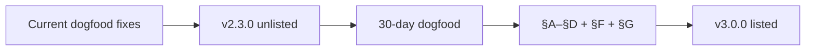

# v3.0 focused launch scope (Option A)

> **Decision:** Ship **v3.0.0** as a **text noise filter** with excellent Track 1 UX.  
> **Authenticity assist** remains in the codebase (experimental, off by default) but is **not** a launch gate or store hero claim.  
> **Companion:** [`ux-capability-roadmap.md`](./ux-capability-roadmap.md) · [`v3-acceptance-checklist.md`](./v3-acceptance-checklist.md) · [`version-roadmap.md`](./version-roadmap.md)

---

## What Option A means

| Pillar | v3.0.0 (Option A) | Deferred |
|--------|-------------------|----------|
| **Store positioning** | “Reduce promotional, bait, and toxic **language** — always reversible.” | “Research assist” as primary headline |
| **Launch gates** | Personas **A, B, C, D** + **§F scope honesty** + **§G engineering** | Persona **E** (authenticity E2–E3) |
| **Track 2 work** | Keep mod off by default; wizard opt-in unchanged; no pipeline rewrite in this phase | Script-first gather hardening, store copy for assist |
| **Track 3** | Out of scope | Visual analysis, OCR, image moderation |

---

## Phase exit: v2.3.0 unlisted → v3.0.0 listed

---

## Track A — Filtering trust & visibility (launch-critical)

**Theme:** Users can *see* filtering, trust the stats, and avoid surprise blocks on non-social sites.

### Done (ship in changelog)

- [x] Filter stats: filtered ≤ scanned; count only on successful enforcement
- [x] In-page **“Filtered — click to show”** badge (all filter styles)
- [x] Context-aware pack merge (no social packs on academic hosts)
- [x] Mode ↔ pack bundles (Focus / Unwind / Research)
- [x] Reveal feedback loop (wrong block / good block)
- [x] Wizard text-only limitation copy

### Remaining (Track A)

| # | Deliverable | Persona | Gate |
|---|-------------|---------|------|
| A-R1 | **Block reason in session UI** — show label + detector on Recent filtered rows and/or popup | A3 | ✅ |
| A-R2 | **Non-social FP pass** — tune thresholds / page context for music + review sites (Spotify, RYM class); document music whitelist preset | D1, D4 | ✅ |
| A-R3 | **FP audit report** — run `scripts/filter-audit.mjs` on dogfood corpus; record balanced/Research FP counts | D4 | ✅ |
| A-R4 | **Scope honesty pack** — FAQ or known-limitations doc; link from Filtering tab; store copy audit (§F1–F3) | All | §F | ✅ |
| A-R5 | **Structured dogfood** — Reddit + one news site + one non-social; sign off §A1–A4, B1–B3, C1–C3 | A–C | §A–§C | ✅ |

**Out of scope for Track A:** layout mods, new pack languages, collapse redesign, badge customization.

---

## Track C — Release ops

**Runbook:** [`v2.3-release-ops.md`](./v2.3-release-ops.md) · **Preflight:** `pnpm release:preflight`

| # | Deliverable | Artifact | Status |
|---|-------------|----------|--------|
| C-R1 | Commit + tag **`v2.3.0`** unlisted (Chrome + Firefox) | Release zips + tag on `0cedcd6` | ✅ tag/zips · ☐ upload |
| C-R2 | Firefox manual QA rows 1–8, 14 | [`firefox-qa.md`](../guides/firefox-qa.md) | ☐ manual |
| C-R3 | §G engineering gates green on release branch | `pnpm release:preflight` + CI | ✅ automated |
| C-R4 | Store assets refreshed for **text-filter** positioning (no authenticity hero) | [`store/SCREENSHOTS.md`](../../store/SCREENSHOTS.md) | ☐ capture |
| C-R5 | **30-day dogfood** on v2.3.x; &lt; 5 critical issues | [`dogfood-issue-log.md`](../qa/dogfood-issue-log.md) | ☐ |
| C-R6 | §A–§D + §F sign-off table complete | [`v3-acceptance-checklist.md`](./v3-acceptance-checklist.md) | ☐ |
| C-R7 | Tag **`v3.0.0`** listed after gates pass | Public store | ☐ |

---

## v3.0 acceptance — required vs optional (Option A)

| Section | Required for v3.0.0? |
|---------|----------------------|
| §A Focus seeker | ✅ Yes |
| §B Comment survivor | ✅ Yes |
| §C Preference curator | ✅ Yes |
| §D Researcher | ✅ Yes |
| §E Skeptic (authenticity E2–E3) | ❌ No — E1 + E4 only (off by default) |
| §F Scope honesty | ✅ Yes |
| §G Engineering | ✅ Yes |

---

## Store copy constraints (Option A)

**Say:**

- Textual noise reduction (promo, bait, toxic **language**)
- Reveal-first — click to show
- Works on page **text**; image-only posts not filtered
- Optional experimental features may exist in dashboard — not marketed on listing

**Do not say:**

- Blocks misinformation / fact-checks your feed
- Analyzes images or memes
- Authenticity assist as primary value prop

---

## Sprint order (recommended)

1. **A-R1** Block reason in session UI (closes “did it work?” gap)
2. **A-R2** Non-social FP tuning (closes Spotify/RYM class surprises)
3. **A-R4** Scope docs + store copy (parallel)
4. **C-R1** v2.3.0 unlisted tag
5. **A-R3 + A-R5 + C-R2–C-R6** Dogfood + gates
6. **C-R7** v3.0.0 listed

---

## Explicitly deferred (post–v3.0.0)

- Track 2 authenticity pipeline hardening (v3.1+ if promoted to store hero)
- Layout mods (comment region collapse)
- Pack marketplace / FR locales
- Track 3 visual analysis

---

## Open items (resolve during Track A)

| Question | Default for Option A |
|----------|----------------------|
| Block reason UX surface | Recent filtered + popup (both) |
| Non-social tuning | Context exclusions + Research mode on review sites |
| Authenticity in Plugins tab | Keep; label “Experimental — not part of v3.0 launch” |

---

## Related

- [`v3-acceptance-checklist.md`](./v3-acceptance-checklist.md) — full gate matrix  
- [`v2.2-store-prep.md`](./v2.2-store-prep.md) — unlisted submit steps (carry forward to v2.3.0)  
- [`ux-capability-roadmap.md`](./ux-capability-roadmap.md) — persona priorities
