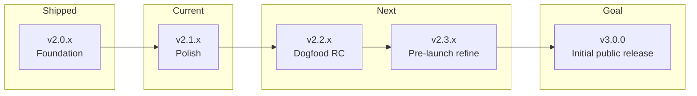

# Version Roadmap

> **North star:** **v3.0.0** — first **production-ready** release suitable for **initial public rollout** on Chrome Web Store and Firefox Add-ons.  
> **Current version:** `2.2.0` (unlisted store RC — screenshots + Firefox manual QA before submit)  
> **Related docs:** [Product phases (historical)](./product-roadmap.md) · [Technical core](../../CORE-ROADMAP.md) · [Authenticity assist](../experimental/authenticity-analysis.md) · [Store release](../guides/store-release.md)

---

## Product vision (pre–v3.0.0)

Before the first public launch, we refine **three systems** to production quality:

| System | Role at launch | Pre-launch focus |
|--------|----------------|------------------|
| **Scanning** | Universal discovery of content units on any page | Accuracy, stability, site hints, perf |
| **Filtering** | User-defined noise reduction (heuristic + optional models) | Scoring, false positives, modes, enforcement |
| **Authenticity assist** | Experimental AI advisory on user-selected claims | Script-first retrieval, grounded analysis, token efficiency |

| **Wizard-first checklist** | [`wizard-first-checklist.md`](./wizard-first-checklist.md) |

### Platform principles |

- **Plugin-based and extensible** — detectors, actions, analyzers, and site hints ship as mods; signed install path for optional packs. Good **defaults** so a fresh install works without tuning.
- **Wizard-first configuration** — the onboarding wizard should capture **most** user intent (mode, topics, whitelist, sensitivity, filter style). The dashboard remains available for power users but must not be required for day-one value.
- **Public data only (authenticity)** — analysis aggregates **publicly available, web-indexed** information. No access to private accounts, paywalled content the user cannot reach, internal databases, or non-indexed material. See [Data acquisition](#data-acquisition-authenticity) below.

### Data acquisition (authenticity)

The ideal pipeline balances **speed** and **token efficiency**:

```
Scripts & APIs gather public data  →  normalize & cache  →  AI cross-references against a standard framework
```

| Stage | Who does the work | What happens |
|-------|-------------------|--------------|
| **Gather** | Automated scripts (search APIs, fetch, structured feeds, DOM extract) | Collect URLs, snippets, metadata from public sources |
| **Normalize** | Extension runtime (no LLM) | Dedup, allowlist, snippet verification, cache by query hash |
| **Analyze** | AI models (T1/T3 tiers) | Compare claims to **pre-fetched** evidence; structured JSON output only |

**LLMs do not browse the web or invent sources.** They receive claims plus verified snippets the scripts already retrieved. Full spec: [`authenticity-analysis.md`](../experimental/authenticity-analysis.md).

---

## How to read this document

| Concept | Meaning |
|---------|---------|
| **Version** | User-facing release (`package.json` / manifest). Shippable artifact. |
| **Phase** | Internal milestone grouping work across one or more versions. |
| **Track** | Product line: **Track 1** = noise filtering (core value); **Track 2** = authenticity assist (experimental). |
| **Build profile** | `core` (default, heuristic, small) vs `full` (ONNX, blur/collapse, hint mods). |

**Principle:** Ship the **core build** early. Treat **full build** and **model tiers** as upgrades, not blockers for first public listing.

---

## Journey at a glance



| Version | Phase | Theme | Audience |
|---------|-------|-------|----------|
| **2.0.x** | 1 — Foundation | Modular core, universal scanner, product surfaces | Contributors |
| **2.1.x** | 2 — Configure & trust | Wizard-first UX, heuristics, whitelist, dashboard polish | Dogfooders |
| **2.2.x** | 3 — Dogfood RC | Unlisted store build, QA, ops; wizard covers most setup | Early adopters |
| **2.3.x** | 4 — **Pre-launch refinement** | Scanner + filtering + authenticity hardening; optional full build | Pre-release testers |
| **3.0.0** | 5 — **Initial public release** | All three systems production-ready; listed stores | **General public** |
| **3.1+** | 6 — Expand | Layout mods, marketplace, time budgets, authenticity feeds at scale | Retention / growth |

---

## Phase 1 — Foundation · **v2.0.x** ✅

**Goal:** Replace adapter-first discovery with a reliable, modular filtering core and basic product surfaces.

### In scope (shipped)

- Universal scanner + classification pipeline (extract → classify → enforce)
- Heuristic keyword detector + dim action (**core build** default)
- Browsing modes (Focus / Research / Unwind)
- Popup, options dashboard, onboarding wizard
- User rules: block keywords, allow keywords, per-site threshold
- Plugin library, signed mod install path
- Noise-pattern supplemental detector
- Authenticity assist mod (experimental, advisory, off by default)
- CI, scanner acceptance E2E, store release scripts

### Out of scope (deferred)

- Public store listing
- Bundled ONNX as default
- Third-party mod marketplace
- Auto-blocking “misinformation”

### Exit criteria ✅

- `pnpm test:ci` green on core build
- E2E filtering passes via universal scanner
- Options + wizard write coherent storage (`policy`, `userRules`, `enabledModIds`)

---

## Phase 2 — Configure & trust · **v2.1.x** (current)

**Goal:** Make the extension **easy to configure** and **trustworthy in daily use** — with the **wizard as the primary setup path**.

### In scope

| Area | Deliverables |
|------|----------------|
| **Filtering UX** | Dedicated Filtering tab; sensitivity + style previews; keyword defaults |
| **Rules UX** | Site whitelist presets + custom domains; pause filtering from popup |
| **Overview** | Status strip (mode, whitelist count, filtered today) |
| **Onboarding** | “Work apps” whitelist step; setup-again prefill; **wizard writes ≥80% of typical user config** |
| **Dashboard** | Advanced options collapsed by default; link from wizard “fine-tune later” |
| **Plugins UX** | Advanced collapse (core mods vs full-build locked); sensible default mod set |
| **Heuristics** | Weighted scoring, text-gate tuning, fewer false positives |
| **Runtime fix** | Policy threshold forwarded through background `classifyBatch` |
| **i18n** | en/de baseline for dashboard shell |

### Out of scope

- New detector backends (ONNX training, remote API productization)
- Authenticity v3 (fact-check feeds, thread scope)
- Store screenshots and production signing keys

### Target versions

| Version | Focus |
|---------|--------|
| **2.1.0** | Filtering tab, whitelist, popup page status, wizard whitelist step |
| **2.1.1** | Heuristic tuning, threshold bug fix, core test coverage |
| **2.1.2** | Firefox manual QA pass, README/status alignment, changelog |

### Exit criteria

- [ ] New user completes **wizard only** (no dashboard visit) → filtering works on a fixture page in &lt; 2 minutes (manual)
- [x] Wizard output covers: mode, block topics/keywords, whitelist, sensitivity, filter style, enabled core mods
- [x] Checklist in [`wizard-first-checklist.md`](./wizard-first-checklist.md) — automated items verified
- [x] `pnpm test:core` + full Vitest suite green (129 tests)
- [x] `pnpm release:verify` passes (dev signing key warning OK until v2.2)
- [x] `pnpm test:firefox` automated tests green
- [ ] Firefox manual smoke rows **1–8**, **14** signed off

---

## Phase 3 — Dogfood release candidate · **v2.2.x**

**Goal:** Produce a **store-submittable core build**, validate **wizard-first onboarding** with a **limited, unlisted** audience, and begin structured dogfooding of all three systems.

### In scope

| Area | Deliverables |
|------|----------------|
| **Store ops** | Production mod-signing key; privacy policy URL live; listing copy + screenshots |
| **Release** | Tag `v2.2.0`; GitHub Release workflow; Chrome + Firefox core zips |
| **QA** | Full [`RELEASE-CHECKLIST.md`](../../store/RELEASE-CHECKLIST.md); manual matrix on Reddit + 2–3 generic sites |
| **Docs** | README reflects core-first positioning; remove “unstable prototype” where inaccurate |
| **Support** | Issue template, known-limitations section, feedback channel |
| **Wizard QA** | First-run + “set up again” tested on Chrome and Firefox; dashboard optional |

### Out of scope

- Public (listed) store visibility
- ONNX in default download
- Full authenticity pipeline rewrite (starts in 2.3.x)

### Exit criteria

- [ ] Unlisted Chrome + Firefox listings approved
- [ ] ≥80% of dogfooders complete setup via wizard without opening dashboard tabs
- [ ] No P0 bugs in 2 weeks of dogfood on scanning + filtering
- [ ] Privacy policy and permissions match actual behavior
- [ ] Core zip &lt; store size guidelines; no dev keys in package

---

## Phase 4 — Pre-launch refinement · **v2.3.x**

**Goal:** Harden **scanning**, **filtering**, and **authenticity assist** to the quality bar required for **v3.0.0**. Optional full build ships here, not as a prerequisite for public launch.

### Track 1 — Scanning & filtering

| Area | Deliverables |
|------|----------------|
| **Scanner** | Site-hint tuning; expand triggers; perf regression gates; Reddit/generic acceptance |
| **Filtering** | Heuristic + noise-pattern refinement; false-positive audits; mode presets validated |
| **Full build (opt-in)** | ONNX local-pack; blur + collapse; model pack selection; heuristic fallback |
| **Plugins** | Default mod bundle documented; one-click restore defaults in dashboard |

### Track 2 — Authenticity assist

| Area | Deliverables |
|------|----------------|
| **Script-first gather** | Search API + fetch scripts own retrieval; structured feeds (ClaimReview where available) |
| **Public-data boundary** | Allowlist + robots-aware fetch; no private/login-gated content; explicit “could not fetch” states |
| **AI analysis tier** | T3 compares claims to **pre-fetched** snippets only; standardized epistemic framework JSON |
| **Token efficiency** | Separate gather vs analyze steps; retrieval cache; “search only” zero-token mode |
| **UX** | Scope picker; quota estimates; auditable trail (claim → query → URL → snippet → comparison) |

### Track 3 — Wizard & defaults

| Area | Deliverables |
|------|----------------|
| **Wizard completeness** | Optional authenticity opt-in step; API key only if user enables assist |
| **Dashboard** | “Recommended” vs “Advanced” sections; wizard prefill on every major settings tab |
| **Defaults** | Focus mode + balanced + core mods + authenticity off — no empty-state traps |

### Out of scope

- Runtime model download from Hugging Face (bundled packs only)
- Authenticity auto-run on scroll or full social feeds
- LLM-as-browser (models do not fetch URLs themselves)

### Exit criteria

- [ ] Scanner acceptance suite green; no runaway rescans on SPA fixtures
- [ ] Filtering: balanced mode false-positive rate acceptable on dogfood corpus
- [ ] Authenticity: end-to-end path uses script gather → snippet verify → LLM compare; zero hallucinated URLs in test set
- [ ] Privacy policy states **public sources only** for authenticity retrieval
- [ ] Full build optional; core-only users can reach all v3.0.0 filtering features

---

## Phase 5 — Initial public release · **v3.0.0** 🎯

**Goal:** First release suitable for **general public rollout** — scanning, filtering, and authenticity assist (experimental) meet the refinement bar from Phase 4.

### Definition of “production-ready”

| Pillar | Requirement |
|--------|-------------|
| **Scanning** | Universal scanner stable on common sites; documented limits; hint mods optional |
| **Filtering** | Wizard-configured setup works on first browse; reveal-first enforcement reliable |
| **Authenticity** | Script-gathered public evidence + AI cross-reference; advisory only; off by default |
| **Configuration** | **Wizard completes typical setup**; dashboard for fine-tuning, not required |
| **Plugins** | Core mod bundle + signed optional packs; restore defaults available |
| **Privacy** | Public-data-only retrieval documented; no telemetry by default; policy URL stable |
| **Platforms** | Chrome MV3 + Firefox MV2 parity for core + authenticity surfaces |
| **Support** | Changelog, known issues, upgrade path from 2.3.x |
| **Positioning** | Personal browsing layer — not detox, not censorship, not “truth enforcement” |

### In scope for v3.0.0

- Public (listed) Chrome Web Store + AMO listings
- Core build as primary download; full build as documented upgrade
- Stable brand name decision (working name: SignalLens)
- Onboarding wizard as **primary** first-run experience
- Authenticity assist listed as **experimental**, **opt-in**, **public sources only**

### Out of scope for v3.0.0

- Mobile browsers
- Sync across devices
- Team / enterprise admin
- Large-scale third-party mod marketplace

### Exit criteria (initial public rollout gate)

- [ ] 30 days stable on unlisted 2.3.x with &lt; 5 critical issues across all three systems
- [ ] Wizard-only setup validated with external testers (no dashboard required)
- [ ] Authenticity test suite: script gather → verify → analyze; no model-generated URLs
- [ ] Store reviews addressed; no policy violations open
- [ ] `pnpm test:ci` + Firefox QA green on release tag
- [ ] User docs: install, wizard walkthrough, FAQ, privacy (public data boundary)
- [ ] Rollback plan (previous store version retained)

---

## Phase 6 — Expand · **v3.1+** (post-launch)

Prioritized backlog **after** initial public release. Core authenticity framework ships in 2.3.x / 3.0.0; items here extend coverage and scale.

| Theme | Examples | Track |
|-------|----------|-------|
| **Authenticity scale** | Broader fact-check feeds, thread-scope UX, batch compare | 2 |
| **Layout mods** | Hide sidebars, Shorts skip, structural noise | 1 |
| **Time budgets** | Soft per-site session limits | 1 |
| **Mod marketplace** | Curated third-party signed mods | 1 |
| **Sync** | Export/import settings (file-based first) | 1 |
| **Locales** | Additional languages beyond en/de | 1 |

---

## Scope boundaries (all versions)

### Always in (Track 1 core promise)

- User-defined relevance (keywords, modes, allowlists)
- Reveal-first enforcement (click to show filtered content)
- Client-side heuristic classification by default
- Local storage for rules and stats

### Never in (non-negotiable)

- Auto-blocking content for “truth” or “misinformation”
- Covert surveillance or sale of browsing data
- Full-feed authenticity analysis without explicit user action
- LLM browsing or citing non-public / non-fetched sources
- Requiring dashboard navigation to complete first-run setup

### Optional / tiered

| Capability | Core build | Full build |
|------------|------------|------------|
| Heuristic + noise patterns | ✅ | ✅ |
| Dim | ✅ | ✅ |
| Blur / collapse | — | ✅ |
| ONNX local pack | — | ✅ |
| Site hint mods | — | ✅ |
| Remote API detector | — | ✅ (self-hosted) |
| Authenticity assist | ✅ (off by default) | ✅ |

---

## Version ↔ engineering map

Use this when planning sprints or PR scope.

```
v2.0.x  ←  Phases A–G, 8–11, I (scanner), core 1–10           [done]
v2.1.x  ←  Wizard-first UX, heuristics, whitelist               [active]
v2.2.x  ←  Unlisted RC, store ops, wizard dogfood
v2.3.x  ←  Scanner + filter + authenticity refinement; full build opt-in
v3.0.0  ←  Initial public release (all three systems ready)
v3.1+   ←  Scale authenticity feeds, layout mods, marketplace
```

Historical letter-phases (A–G, H, I) remain documented in [`product-roadmap.md`](./product-roadmap.md) for archaeology; **this file is the forward-looking plan.**

---

## Immediate next steps (close v2.1.x → open v2.2.x)

1. **Manual smoke:** install → wizard **Start browsing** only → confirm filtering on a normal page ([`wizard-first-checklist.md`](./wizard-first-checklist.md))
2. **Firefox manual QA:** rows 1–8 and 14 in [`firefox-qa.md`](../guides/firefox-qa.md)
3. **Tag `v2.1.2`** — done; zips in `releases/`
4. **Open v2.2.0:** screenshots, bump to 2.2.0, unlisted store listing ([`v2.2-store-prep.md`](./v2.2-store-prep.md))
5. Plan **2.3.x** refinement sprints (scanner → filtering → authenticity script-first pipeline)

---

## Open decisions (resolve before v3.0.0)

| Decision | Options | Target version |
|----------|---------|----------------|
| **Final product name** | SignalLens vs rename | v2.2–v3.0 |
| **Default wizard preset** | Focus vs Research for first-run | v2.1–v2.2 |
| **Wizard steps for authenticity** | Off-by-default skip vs optional enable step | v2.2–v2.3 |
| **Retrieval script providers** | Wikipedia + Brave + ClaimReview priority order | v2.3 |
| **Full build distribution** | Separate listing vs signed unlock in core | v2.3 |
| **Authenticity in store copy** | “Experimental, public sources only” wording | v2.2 |
| **Minimum Firefox version** | ESR vs current | v2.2 |

---

## Changelog convention

- **Patch** (`2.1.x`): bug fixes, copy, locale, heuristic tuning
- **Minor** (`2.x.0`): new user-facing capability (whitelist, ONNX tier)
- **Major** (`3.0.0`): public production commitment; breaking storage/API changes only if unavoidable

Tag format: `v2.1.0`, `v3.0.0` — triggers GitHub Release workflow per [`store-release.md`](../guides/store-release.md).
