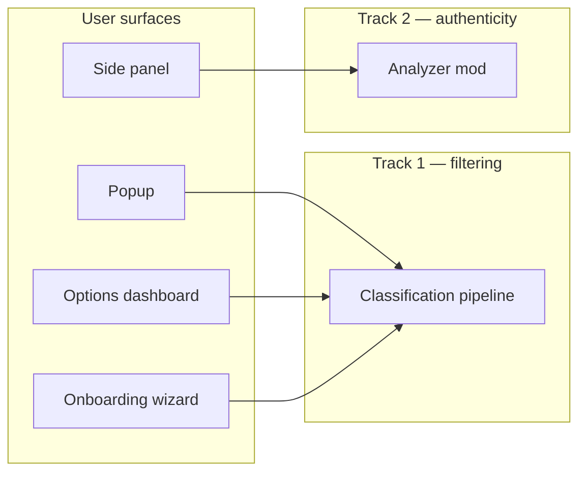

# Product Roadmap

> **Status:** Exploration / active design  
> **Audience:** Contributors and future users  
> **Doc index:** [`docs/README.md`](./README.md)  
> **Technical core (complete):** [`CORE-ROADMAP.md`](../CORE-ROADMAP.md)

## Product value

**Your time and energy are precious. Browse the web with focus and on your terms.**

This is not a “detox” or moralizing filter. The extension is a **personal browsing layer**:

- **Track 1 — Noise filtering:** reduce irrelevant content using *your* rules and preferences.
- **Track 2 — Authenticity assist (experimental):** help you read critically with *advisory* flags and sourced comparisons — never auto-blocking “untrue” content.

The core provides orchestration (extract → classify → enforce). **Mods and user settings define relevance.** Authenticity analysis is a **separate mod and UI**, not an extension of the filter pipeline.

---

## Conceptual model

Users mix four layers:

| Layer | Question | Examples |
|-------|----------|----------|
| **Intent** | What am I doing right now? | Focus, research, unwind |
| **Signal rules** | What do I care about / ignore? | Keywords, topics, sources, formats |
| **Site behavior** | How should this site behave? | Hide Reddit sidebar; skip YouTube Shorts |
| **Presentation** | How should matches look? | Dim, collapse, hide, annotate |

### Architecture mapping (Track 1)

```
Intent + rules     →  detector mods (heuristic, local-pack, remote-api, future)
Site structure     →  adapter mods (Reddit, YouTube, generic, …)
Visual treatment   →  action mods (dim, blur, collapse, future annotate)
```

### Browsing concepts to explore

1. **Modes / presets** — One tap swaps threshold, keywords, filter style, and enabled site mods.
2. **Allowlists & blocklists** — Per-site or global keyword / domain rules.
3. **Content-type filters** — Promos, outrage bait, engagement bait (detector mods).
4. **Layout mods** — Hide sidebars, promos, “Games on Reddit” (structural noise).
5. **Time budgets** — Soft limits per site or session (future mod).
6. **Reveal-first UX** — Filtered content is always reversible.

---

## Extension surfaces

| Surface | Role | Phase |
|---------|------|-------|
| **Popup** (`index.html`) | On/off, active mode, quick stats | Exists |
| **Options / dashboard** (`options.html`) | Modes, plugin library, per-site rules, quotas, privacy | B |
| **Onboarding wizard** | First-run preset + enabled mods | C |
| **Side panel** (`sidepanel.html`, planned) | Authenticity reports, analysis progress | G |



---

## Product phases

### Technical foundation ✅

Core modular refactor **Phases 1–6** — complete. See [`CORE-ROADMAP.md`](../CORE-ROADMAP.md).

- Slim default build: heuristic + generic adapter + dim
- Full build opt-in: site adapters, ONNX lazy-load, blur/collapse
- Windows-friendly `pnpm build`

---

### Phase A — Rename & reframe ✅

- [x] New working name: **SignalLens** (temporary)
- [x] Manifest + popup copy: remove “Detox” / “toxicity” framing
- [x] README aligned with “browse on your terms” positioning

**Done when:** Installed extension reads as a browsing utility, not a detox tool. ✅

---

### Phase B — Options dashboard ✅

- [x] `options.html` full-page UI (React, shared components with popup)
- [x] Sections: overview, modes, per-site overrides, plugin library (read-only catalog first), privacy, advanced (export/import)
- [x] Move heavy settings out of popup
- [x] Link to experimental mod settings (disabled until Phase G) via dashboard/plugin roadmap messaging

**Done when:** All non-essential configuration lives on the options page. ✅

---

### Phase C — Onboarding wizard

- [ ] First-run flow (`onboardingComplete` in storage)
- [ ] Steps: welcome → what bothers you → filter style → sites you use → sensitivity → done
- [ ] Writes `policy`, `inferenceRouting`, `enforcementAction`, enabled mod ids
- [ ] “Set up again” from dashboard

**Done when:** New users get a guided preset instead of implicit defaults (hardcoded keywords).

---

### Phase D — User-defined rules

- [ ] Custom keyword / topic lists (seed heuristic or dedicated detector mod)
- [ ] Allowlist / blocklist by domain and site-specific selectors
- [ ] Wizard output feeds into these lists

**Done when:** Filtering reflects user intent; Reddit/forum pages show visible effect for typical setups.

**Priority:** High — unlocks day-to-day value before authenticity work.

---

### Phase E — Plugin library v1

- [ ] UI over `src/mods/mod-manifest.ts` (catalog + enable/disable)
- [ ] Extended mod metadata: description, icon, size, permissions summary
- [ ] Runtime enable/disable for bundled mods (dynamic import when toggled on)

**Done when:** Users enable Reddit adapter or blur action without rebuilding.

---

### Phase F — Signed mod installs

- [ ] Downloadable mod packages (adapters, detectors, actions, analyzers)
- [ ] Signature verification before registration
- [ ] Heavy mods (ONNX packs) show size + download progress; lazy load on first use

**Done when:** Optional mods install from the library without a full rebuild.

---

### Phase G — Authenticity assist mod (experimental → product)

Spec: [`experimental/authenticity-analysis.md`](./experimental/authenticity-analysis.md)

**Principles (non-negotiable):**

| Principle | Implementation |
|-----------|----------------|
| Selection-first | Default: analyze highlighted text or block; not full social feeds |
| Full-page opt-in | Blogs / papers only; quota warning on dense sites |
| Flag, never block | Advisory badge + side panel; no dim/blur for “misinformation” |
| Grounded citations | Retrieve-then-read; LLM never emits URLs; snippet verification |
| Tiered cost | T0 heuristics → T1 local → T2 search-only → T3 LLM on snippets |
| Explicit action | Context menu / button; no analyze-on-scroll |

**Deliverables:**

- [ ] **G1 — Spike 0:** Manual feasibility script; measure citation quality and cost
- [ ] **G2 — Selection UI:** Context menu “Analyze selection”; scope picker; side panel shell
- [ ] **G3 — T2 search-only:** Real search results, zero LLM tokens; list links for user
- [ ] **G4 — Grounded T3:** Fetch → verify snippets → structured LLM compare; URL allowlist enforcement
- [ ] **G5 — Adapter integration:** `AnalysisScope` from Reddit / Quora adapters; advisory flags
- [ ] **G6 — Dashboard:** Quota caps, API key setup, tier toggles, “search only” default option

**Done when:** User can select a forum comment, receive an advisory report with auditable sources, and no content is hidden automatically.

**Depends on:** Phase B (settings surface) recommended; Phase D optional but improves adapter maturity.

---

## Experimental features (reference)

| Feature | Doc | Track |
|---------|-----|-------|
| Authenticity / claim assist | [`experimental/authenticity-analysis.md`](./experimental/authenticity-analysis.md) | 2 |

Future experimental specs → [`experimental/README.md`](./experimental/README.md).

---

## Recommended implementation order

```
A (rename) ──► B (dashboard) ──► C (wizard) ──► D (user rules)     ← Track 1 value
                      │                                             
                      └──────────────► E (plugin library) ──► F (signed mods)
                      │                                             
                      └──────────────► G (authenticity)              ← Track 2, after D or in parallel after B
```

1. **A + C** — First impression and guided setup.
2. **D** — Visible filtering on sites users actually browse.
3. **B + E** — Power-user customization and mod toggles.
4. **G spikes** — Prove citation integrity before heavy UI investment.
5. **F** — When third-party mods become a goal.

---

## Open questions (exploration)

- **Naming** — Brand that reflects personalization, not judgment.
- **Default preset** — Wizard recommendations for “casual” vs “research” browsing.
- **Side panel vs inline-only flags** — Primary authenticity UI (side panel likely).
- **“Search only” as default** — Zero LLM cost mode before synthesis opt-in.
- **Mod marketplace** — Bundled-only vs signed third-party; curation model.
- **Firefox parity** — Options, wizard, side panel on MV2 build.

---

## Core v0.1 checklist (technical)

From [`CORE-ROADMAP.md`](../CORE-ROADMAP.md):

| # | Criterion | Status |
|---|-----------|--------|
| 1 | Loads with no model files; heuristic provider | ✅ |
| 2 | Swapping detector = setting + mod | ✅ |
| 3 | New site = adapter mod | ✅ |
| 4 | Task-neutral IPC and adapter types | ✅ |
| 5 | ML deps lazy unless local pack active | ✅ |
| 6 | Policy enforces threshold on score | ✅ |

**Product v0.1** additionally requires Phases **A + C + D** (rename, wizard, user-visible rules).

---

## Notes

- Legacy `detox` prefixes may remain in code during migration.
- Delete [`CORE-ROADMAP.md`](../CORE-ROADMAP.md) after Phase A is verified and README is updated.
- [`v2-roadmap.md`](../v2-roadmap.md) is historical; use this file for forward planning.
